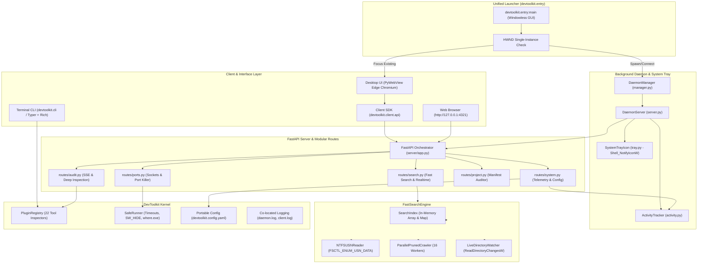
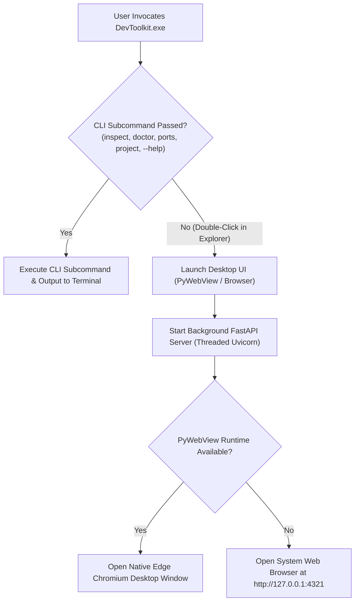

# DevToolkit: Master Software Reference & Technical Manual

> **Author**: Bhardvaj  
> **Version**: 0.5.1 (Phase 14: Decoupled Daemon, Fast Search & Portable Storage)  
> **Repository**: [https://github.com/Bhardvaj/DevToolkit](https://github.com/Bhardvaj/DevToolkit)  
> **Document Purpose**: Authoritative reference manual documenting the software architecture, discovery algorithms, deep inspection heuristics, utility modules, REST APIs, desktop UI, and distribution pipelines.

---

## 1. System Architecture & Core Philosophy

DevToolkit is engineered as a decoupled workstation environment auditor, port manager, file search engine, and developer productivity suite. It bridges the gap between terminal CLI speed and native desktop ergonomics, giving engineers instant insight into their tools, sockets, and project readiness.

### Core Architectural Principles

1. **Zero Hardcoded Paths**:
   No tool location is assumed. SDKs installed in custom drives (e.g. `D:\Dev`, `E:\Tools`), package managers (`nvm-windows`, `pyenv-win`, `scoop`, `winget`, `choco`), or embedded inside IDEs (e.g. Android Studio JBR) are resolved dynamically via the 4-layer pipeline.
2. **Decoupled Background Daemon Service**:
   The central host service is a headless, detached background daemon (`devtoolkit.daemon.server`) that runs independently of client windows, serving FastAPI REST/SSE endpoints, managing real-time file index watchers, and displaying a native Windows system tray icon (`devtoolkit.daemon.tray`).
3. **Zero Host Pollution & Portable Co-Location**:
   DevToolkit leaves no footprints in the user's home profile (`Path.home() / ".devtoolkit"` is never created). Configuration (`devtoolkit.config.yaml`), daemon state (`daemon.json`), and rotating logs (`daemon.log`, `client.log`) reside strictly beside the executable or repository root.
4. **Everything-Class Fast Search Engine**:
   Embeds an in-memory, sub-millisecond file search engine (`FastSearchEngine`) leveraging direct NTFS USN Change Journal volume streaming (`DeviceIoControl`) when elevated, a 16-worker parallel directory crawler, and real-time Win32 `ReadDirectoryChangesW` filesystem watchers.
5. **Windowless PE Subsystem & Single-Instance Activation**:
   Compiled with `--windowed` PE GUI subsystem. Explorer double-clicks never spawn a terminal console window. If already running, launching the executable activates the existing window using Win32 `FindWindowW` and brings it to the foreground. Terminal invocations attach via `kernel32.AttachConsole(-1)`.

### Architecture Topology Diagram



---

## 2. The 4-Layer Generalized Discovery Engine

The discovery engine dynamically resolves tool roots, binaries, and companion SDKs through a tiered 4-layer fallback pipeline. If any layer succeeds, subsequent layers are bypassed for performance.

```
+-------------------------------------------------------------+
| Layer 1: Standard PATH & Environment Resolution             |
|   - Searches active PATH directories and where.exe           |
|   - Evaluates standard env flags (JAVA_HOME, ANDROID_HOME)  |
+-------------------------------------------------------------+
                              | (if unresolved)
                              v
+-------------------------------------------------------------+
| Layer 2: OS Uninstall Registry Inspection (Windows)         |
|   - Scans HKLM & HKCU Software\Microsoft\Windows\           |
|     CurrentVersion\Uninstall (64-bit and WOW6432Node)       |
|   - Matches DisplayName and extracts InstallLocation        |
+-------------------------------------------------------------+
                              | (if unresolved)
                              v
+-------------------------------------------------------------+
| Layer 3: Cross-Tool Ecosystem Discovery                     |
|   - Inspects parent IDE configuration XML files             |
|   - Extracts Android Studio JBR, SDK paths, Flutter config   |
+-------------------------------------------------------------+
                              | (if unresolved)
                              v
+-------------------------------------------------------------+
| Layer 4: Content Signature Fingerprinting                   |
|   - Recursively traverses user-configured root directories  |
|     (e.g. D:\Dev, C:\Dev, /opt)                             |
|   - Validates directory structures by marker files          |
+-------------------------------------------------------------+
```

### Layer 1: Standard PATH & Environment Resolution
- Evaluates `os.environ["PATH"]` using `SafeRunner.resolve_binary(name)`.
- On Windows, automatically tests `.exe`, `.cmd`, `.bat`, and `.ps1` extensions.
- Evaluates known tool environment variables (e.g. `JAVA_HOME`, `ANDROID_HOME`, `ANDROID_SDK_ROOT`, `GOROOT`, `GOPATH`, `DOCKER_HOST`, `NVM_HOME`).

### Layer 2: Windows OS Registry Inspection (`WindowsRegistryInventory`)
- Probes four registry root combinations:
  - `HKEY_LOCAL_MACHINE\Software\Microsoft\Windows\CurrentVersion\Uninstall` (64-bit)
  - `HKEY_LOCAL_MACHINE\Software\WOW6432Node\Microsoft\Windows\CurrentVersion\Uninstall` (32-bit)
  - `HKEY_CURRENT_USER\Software\Microsoft\Windows\CurrentVersion\Uninstall` (64-bit)
  - `HKEY_CURRENT_USER\Software\WOW6432Node\Microsoft\Windows\CurrentVersion\Uninstall` (32-bit)
- Matches target tools via regex against `DisplayName`.
- Resolves `InstallLocation` or parses uninstall strings to extract the physical root folder.

### Layer 3: Cross-Tool Ecosystem Discovery (`CrossToolEcosystem`)
- Locates SDKs through tools that bundle or manage them:
  - **Android Studio Config**: Reads `%APPDATA%\Google\AndroidStudio*\options\other.xml` to extract configured Android SDK directories.
  - **Embedded JBR**: Inspects Android Studio installation directories for `jbr/bin/java.exe` or `jre/bin/java.exe`.
  - **Flutter SDK Config**: Reads `%APPDATA%\flutter\tool_state` or global configuration to extract Flutter and Dart SDK locations.
  - **Gradle Properties**: Reads `~/.gradle/gradle.properties` for configured JDK paths.

### Layer 4: Content Signature Fingerprinting (`ContentSignatureEngine`)
- Users specify high-level directories (e.g. `D:\Dev`, `C:\Tools`) in `devtoolkit config add-path <dir>`.
- The engine traverses immediate and second-level subfolders, matching specific structural signatures:
  - **Android SDK**: Folder must contain `platform-tools/adb.exe` AND (`emulator/emulator.exe` OR `cmdline-tools`).
  - **Java / JDK**: Folder must contain `bin/javac.exe` AND (`bin/java.exe` OR `lib/tools.jar`).
  - **Flutter SDK**: Folder must contain `bin/flutter` AND `bin/cache/dart-sdk`.
  - **Go SDK**: Folder must contain `bin/go.exe` AND `src/runtime`.

---

## 3. Tool Inspector Catalog, Taxonomy & Diagnostic Specification

DevToolkit provides a pluggable inspection architecture featuring 22 specialized domain inspectors (`devtoolkit/modules/inspectors/`). Every inspector implements two auditing interfaces:
1. **`inspect(runner: SafeRunner) -> ToolReport`**: High-speed, non-blocking baseline probe executed during global workstation discovery. Discovers executables, parses version strings, queries companion tools, and computes immediate health status.
2. **`deep_inspect(runner: SafeRunner, base_report: Optional[ToolReport] = None) -> DeepTelemetryReport`**: On-demand deep domain probe executed asynchronously when a developer opens the slide-over Inspector Drawer (`GET /api/tool/{tool_id}/deep`). Performs multi-instance precedence resolution (`where.exe` PATH order, Windows Registry uninstall inventory, IDE bundled runtimes, user search roots), audits environment variable alignment against the active binary, runs forensic CLI commands and raw dumps, and produces copyable remediation commands.

---

### 3.1 Visual Tags, Badges & UI Indicators Reference (The "Why" Behind Every Tag)

The DevToolkit UI uses consistent, color-coded visual tokens across the dashboard and slide-over inspector drawer to convey technical health without ambiguity:

#### 1. Health Status Badges (`getBadge(status)`)
- **`SCANNING`** (`#06B6D4` Cyan with spinner):
  - *Condition*: The backend Server-Sent Events (SSE) channel is actively running asynchronous discovery probes for this tool.
  - *Developer Rationale & Failure Mode Prevented*: Informs the user that inspection is in-flight. Prevents premature assumption that a tool is missing while background probes are resolving.
- **`HEALTHY`** (`#10B981` Emerald pill with glowing indicator):
  - *Condition*: The tool's primary binary is callable, returns a valid version, core companion package managers (e.g. `pip`, `npm`, `cargo`) are installed, and critical environment variables are aligned.
  - *Developer Rationale & Failure Mode Prevented*: Gives developer instant green-light confidence that the toolchain is fully ready to compile, run, and debug projects without errors.
- **`ACTION_NEEDED` / `WARNING`** (`#F59E0B` Amber pill with warning triangle):
  - *Condition*: The tool is installed and callable, but possesses a non-fatal skew, such as: missing global package manager (e.g. `pip` or `npm`), missing companion compiler (`g++`), binary exists on disk but is absent from system PATH, or an environment variable (`JAVA_HOME`, `DOTNET_ROOT`, `ANDROID_HOME`) points to a divergent directory.
  - *Developer Rationale & Failure Mode Prevented*: Highlights latent workstation hazards that will cause cryptic build failures in CLI tools (e.g., Gradle failing because `JAVA_HOME` points to Java 11 while PATH runs Java 21, or VS Code CLI not being in PATH).
- **`ERROR`** (`#EF4444` Red pill with cross mark):
  - *Condition*: An environment variable is broken (e.g. `DOTNET_ROOT` or `JAVA_HOME` pointing to a non-existent folder on disk), or the binary exists as an uninstalled stub (0KB Microsoft Store alias).
  - *Developer Rationale & Failure Mode Prevented*: Immediately flags critical toolchain corruption that prevents any compilation or runtime execution.
- **`NOT_FOUND` / `NOT DETECTED`** (`#94A3B8` Slate pill with muted dot):
  - *Condition*: The tool's executable was not found in system PATH, Windows Registry uninstall keys, standard installation folders, or user-configured Search Roots.
  - *Developer Rationale & Failure Mode Prevented*: Cleanly categorizes uninstalled tools without generating noisy warnings, preserving developer focus on tools they actually use.

#### 2. Precedence & Instance Origin Pills
- **`Active in PATH`** (`#10B981` Emerald border/bg):
  - *Condition*: The executable resolved as index 0 by `where.exe` / `runner.resolve_binary()`, which is what the Windows command interpreter (`cmd.exe` / `powershell.exe`) executes when typing the command.
  - *Developer Rationale & Failure Mode Prevented*: Eliminates "which version am I actually running?" confusion when multiple installations exist on the machine.
- **`Alternate in PATH` / Standby** (`#1F2430` Slate border):
  - *Condition*: Additional executables with the same name located further down in the `PATH` environment variable order.
  - *Developer Rationale & Failure Mode Prevented*: Reveals shadow installations (e.g. an old Git or Python version installed by another software package that could hijack PATH if precedence changes).
- **`Portable / Standalone`** (`#F59E0B` Amber):
  - *Condition*: Executable is located inside `WindowsApps` (Microsoft Store stub) or custom portable directory.
  - *Developer Rationale & Failure Mode Prevented*: Alerts developer when a tool is running from an isolated sandbox or execution alias rather than a traditional installation.
- **Discovery Origin Badges (`PATH`, `Registry`, `SearchRoot`, `IDE_Config`, `Default`, `PyLauncher`, `NVM`)**:
  - *Condition*: Indicates the layer of the 4-Layer Discovery Pipeline that located this instance.
  - *Developer Rationale & Failure Mode Prevented*: Provides a forensic trail showing *why* DevToolkit knows about a tool (e.g., found via Windows Registry uninstall database or embedded inside Android Studio / GitHub Desktop).

#### 3. Environment Variable Alignment Pills (`EnvVarStatus`)
- **`ALIGNED`** (`#10B981` Emerald pill with checkmark):
  - *Condition*: The environment variable exists, points to a valid disk directory, and matches the active executable's root directory (or follows canonical conventions).
  - *Developer Rationale & Failure Mode Prevented*: Confirms toolchain consistency across build scripts and terminals.
- **`DIVERGENT`** (`#F59E0B` Amber pill with triangle):
  - *Condition*: The environment variable exists on disk, but points to a completely different installation than what terminal commands invoke (e.g. `JAVA_HOME` pointing to JDK 17 while PATH resolves JDK 21, or `FLUTTER_ROOT` pointing to an old SDK clone).
  - *Developer Rationale & Failure Mode Prevented*: Prevents subtle compilation bugs where IDEs and CLI tools compile against different SDK versions.
- **`MISSING`** (`#EF4444` Red pill with cross):
  - *Condition*: A critical variable required by external tools is unset (e.g. `ANDROID_HOME` unset while Android SDK is installed, or `JAVA_HOME` unset).
  - *Developer Rationale & Failure Mode Prevented*: Prompts the developer to set mandatory environment variables before Gradle, Android Studio, or React Native builds crash.

#### 4. Ecosystem Companion Badges
- **`vX.Y.Z` / `detected`** (Emerald checkmark) vs **`missing`** (Muted crossmark):
  - *Condition*: Evaluates whether auxiliary CLIs, package managers, compilers, and debuggers exist alongside the primary runtime.
  - *Developer Rationale & Failure Mode Prevented*: Ensures developers have the complete toolchain (e.g., Python with `pip`/`uv`, Node with `npm`/`pnpm`/`yarn`, Rust with `cargo`/`rustup`, CMake with `ninja`).

#### 5. Remediation Command Snippets (Copy-Only, Zero 1-Click Auto-Mutation)
- *Rationale*: DevToolkit strictly adheres to non-destructive auditing. When an issue or misalignment is detected, DevToolkit generates safe, ready-to-run copyable terminal commands (e.g., `setx ANDROID_HOME "..."`, `python -m ensurepip --upgrade`, `winget install Ninja-build.Ninja`) with 1-click clipboard copy buttons. It never modifies the user's workstation environment without explicit consent.

---

### 3.2 Comprehensive 22-Tool Deep Specification & Condition Matrix

#### 1. Python (`python`)
- **Taxonomy & Identity**:
  - ID: `python` | Display Name: `Python`
  - Category: `runtime` | Multi-category tags: `["runtime", "scripting", "ai"]`
  - Description: Python interpreter, pip, uv, poetry, and virtualenv tooling
- **Visual Badges & Tags Rendered**:
  - `HEALTHY` (emerald): Primary interpreter found and `pip` package manager installed in environment.
  - `ACTION_NEEDED` (amber): Python installed, but `pip` is absent.
  - `NOT_FOUND` (slate): `python` and `python3` executables absent from system PATH.
  - `Active in PATH`: First resolved Python executable invoked in terminal.
  - `Microsoft Store App Execution Alias`: Detected `windowsapps` in executable path (flags 0KB Microsoft Store execution alias).
  - `PyLauncher`: Discovered via Windows Python Launcher (`py -0p`).
  - `Registry`: Discovered via Windows Registry uninstall inventory (`OSInventory.find_app_locations("Python")`).
  - `PYTHONPATH`: `ALIGNED` (configured path exists on disk or unset for standard site-packages) vs `DIVERGENT` (configured path does not exist on disk).
  - `PYTHONHOME`: `ALIGNED` (matches active Python home or unset) vs `DIVERGENT` (points to alternate Python root) vs `MISSING` (configured directory does not exist on disk).
  - `VIRTUAL_ENV`: `ALIGNED` (active virtualenv directory exists on disk) vs `DIVERGENT` (virtual environment directory missing).
  - Companion tags: `pip`, `uv`, `poetry`, `conda`, `pipenv` (`vX.Y.Z` or `missing`).
- **`inspect()` Flow Branches & Condition Cases**:
  1. *Binary Resolution*: Calls `runner.resolve_binary("python")` or `runner.resolve_binary("python3")`. If neither resolves -> returns `installed=False, status=HealthStatus.NOT_FOUND`.
  2. *Version Extraction*: Runs `[py_bin, "--version"]`. Splits stdout; extracts second token (e.g. `"3.12.3"`).
  3. *Companion Probing*: Loops through `["pip", "uv", "poetry", "conda", "pipenv"]`. For each, calls `runner.resolve_binary(name)`. If found, executes `--version` and extracts version via regex `(\d+\.\d+(\.\d+)?)`. If not found, appends `CompanionTool(name=name, installed=False)`.
  4. *Health & Diagnostics Logic*: Checks `pip_found = any(c.installed for c in companions if c.name == "pip")`.
     - If `pip_found == False`: Pushes `DiagnosticIssue(level=WARNING, message="pip package manager is not installed in the global environment.", suggested_fix="python -m ensurepip --upgrade")`.
     - Status: `HealthStatus.HEALTHY` if `pip_found` else `HealthStatus.WARNING`.
  5. *Metadata*: Emits `{"base_prefix": sys.base_prefix, "prefix": sys.prefix}`.
- **`deep_inspect()` Forensic Flow Branches & Condition Cases**:
  1. *Multi-Instance Precedence*:
     - Scans `runner.resolve_all_binaries("python")`. Sets index 0 as active. Flags `Microsoft Store App Execution Alias` if path contains `windowsapps`.
     - Probes Windows Python Launcher via `runner.resolve_binary("py")`. Executes `py -0p`, parses lines (e.g. ` -V:3.14 * D:\path\python.exe`), annotates instance as `PyLauncher`.
     - Queries Windows Registry uninstall keys via `OSInventory.find_app_locations("Python")`, testing for `python.exe`.
  2. *Monitored Environment Variables*:
     - `PYTHONPATH`: Reads `runner.read_env("PYTHONPATH")`. If set, checks existence on disk (`aligned` if exists, `divergent` if missing). If unset, reports `aligned` (standard resolution).
     - `PYTHONHOME`: Reads `runner.read_env("PYTHONHOME")`. Compares canonical path against `base_rep.home_path`. Status: `aligned` if match, `divergent` if exists but differs, `missing` if path does not exist.
     - `VIRTUAL_ENV`: Reads `runner.read_env("VIRTUAL_ENV")`. Status: `aligned` if directory exists, `divergent` if missing from disk.
  3. *CLI Dumps & Telemetry*:
     - Executes `python -VV` (timeout 2.5s) -> stored in `raw_dumps["python -VV"]` and `telemetry["build_info"]`.
     - Executes `python -m sysconfig` (timeout 3.0s) -> stored in `raw_dumps["python -m sysconfig"]`.
     - Executes `import site; print(';'.join(site.getsitepackages()))` -> stored in `telemetry["site_packages"]`.
     - Executes `python -m pip cache dir` -> stored in `telemetry["pip_cache_dir"]`.
     - Telemetry: `is_virtualenv`, `virtual_env_path`, `architecture` (`64-bit AMD64` vs `32-bit x86`), `py_launcher_installed`.

---

#### 2. Node.js (`node`)
- **Taxonomy & Identity**:
  - ID: `node` | Display Name: `Node.js`
  - Category: `runtime` | Multi-category tags: `["runtime", "web"]`
  - Description: Node.js runtime, npm, and modern JavaScript package managers
- **Visual Badges & Tags Rendered**:
  - `HEALTHY` (emerald): Node binary operational and `npm` package manager available.
  - `ACTION_NEEDED` (amber): Node installed but `npm` missing from PATH.
  - `NOT_FOUND` (slate): `node` executable not found.
  - `Active in PATH`: Active Node runtime executed by terminal commands.
  - Manager detail tags: `Managed by NVM (Node Version Manager)`, `Managed by fnm (Fast Node Manager)`, `Managed by Volta`.
  - `NVM`: Discovered via NVM Windows directory iteration (`%NVM_HOME%`).
  - `Registry`: Discovered via Windows Registry uninstall keys.
  - `NODE_PATH`: `ALIGNED` (directory exists or unset) vs `DIVERGENT` (path does not exist).
  - `NVM_HOME`: `ALIGNED` (NVM home exists) vs `DIVERGENT` (path does not exist).
  - `NVM_SYMLINK`: `ALIGNED` (points to active Node installation) vs `DIVERGENT` (points to alternate version) vs `MISSING` (symlink broken).
  - Companion tags: `npm`, `pnpm`, `yarn`, `corepack` (`vX.Y.Z` or `missing`).
- **`inspect()` Flow Branches & Condition Cases**:
  1. *Binary Resolution*: Calls `runner.resolve_binary("node")`. If not found -> returns `installed=False, status=HealthStatus.NOT_FOUND`.
  2. *Version Extraction*: Runs `node -v`. Strips leading `'v'` (e.g. `"22.12.0"`).
  3. *Companion Probing*: Probes `["npm", "pnpm", "yarn", "corepack"]` using `runner.resolve_binary()`. Runs `--version` on discovered binaries.
  4. *Health & Diagnostics Logic*: Checks `npm_found = any(c.installed for c in companions if c.name == "npm")`.
     - If `npm_found == False`: Pushes `DiagnosticIssue(level=WARNING, message="npm package manager is not detected alongside Node.js.", suggested_fix="corepack enable")`.
     - Status: `HealthStatus.HEALTHY` if `npm_found` else `HealthStatus.WARNING`.
  5. *Metadata*: Emits `{"prefix": str(node_bin.parent)}`.
- **`deep_inspect()` Forensic Flow Branches & Condition Cases**:
  1. *Multi-Instance Precedence*:
     - Scans `runner.resolve_all_binaries("node")`. Sets index 0 as active. Annotates manager source: `nvm`, `fnm`, or `volta`.
     - Probes `NVM_HOME`. Iterates subdirectories for `node.exe`, recording each installed NVM version.
     - Queries Windows Registry uninstall keys via `OSInventory.find_app_locations("Node.js")`.
  2. *Monitored Environment Variables*:
     - `NODE_PATH`: Status: `aligned` if directory exists or unset, `divergent` if set path does not exist.
     - `NVM_HOME`: Status: `aligned` if path exists, `divergent` if path does not exist.
     - `NVM_SYMLINK`: Canonical path comparison against `base_rep.home_path`. Status: `aligned` if match, `divergent` if points to different version, `missing` if broken.
  3. *CLI Dumps & Telemetry*:
     - Executes `node -p "JSON.stringify(process.versions, null, 2)"` (timeout 2.5s) -> stored in `raw_dumps` and parsed into `telemetry["v8_version"]`, `telemetry["uv_version"]`, `telemetry["openssl_version"]`.
     - Executes `npm config get prefix` -> stored in `telemetry["npm_global_prefix"]`.
     - Executes `npm root -g` -> stored in `telemetry["global_node_modules"]`.
     - Executes `npm config list` (timeout 3.0s) -> stored in `raw_dumps["npm config list"]`.
     - Telemetry: `is_lts`, `release_line` (e.g. `"Node.js v22.x (Active LTS)"`).

---

#### 3. Git (`git`)
- **Taxonomy & Identity**:
  - ID: `git` | Display Name: `Git`
  - Category: `vcs` | Multi-category tags: `["vcs", "tool"]`
  - Description: Git distributed version control system and GitHub CLI
- **Visual Badges & Tags Rendered**:
  - `HEALTHY` (emerald): Git installed and global user identity (`user.name` and `user.email`) configured.
  - `ACTION_NEEDED` (amber): Git installed, but global `user.name` or `user.email` is unset.
  - `NOT_FOUND` (slate): Git binary absent from PATH.
  - `Active in PATH`: Primary git executable.
  - `Registry`: Discovered via Windows Registry uninstall inventory (`cmd/git.exe`).
  - `IDE_Config`: `Embedded Git inside GitHub Desktop` (`AppData/Local/GitHubDesktop/app-*/resources/app/git/cmd/git.exe`).
  - `GIT_SSH`: `ALIGNED` (custom SSH client exists or unset for default OpenSSH) vs `DIVERGENT` (custom SSH client binary missing).
  - `GIT_CONFIG_GLOBAL`: `ALIGNED` (custom config exists or standard `~/.gitconfig` active) vs `DIVERGENT` (configured file missing).
  - Companion tags: `gh` (GitHub CLI).
- **`inspect()` Flow Branches & Condition Cases**:
  1. *Binary Resolution*: Calls `runner.resolve_binary("git")`. If not found -> returns `installed=False, status=HealthStatus.NOT_FOUND`.
  2. *Version Extraction*: Runs `git --version` with regex `git version\s+([0-9a-zA-Z.-]+)` (e.g. `"2.47.1.windows.1"`).
  3. *Companion Probing*: Checks for `gh` (GitHub CLI) via `runner.resolve_binary("gh")` with regex `gh version\s+([0-9.]+)`.
  4. *Health & Diagnostics Logic*: Runs `git config --global user.name` and `git config --global user.email`.
     - If either `user_name` or `user_email` is empty: Pushes `DiagnosticIssue(level=WARNING, message="Global Git user identity (user.name / user.email) is not fully configured.", suggested_fix='git config --global user.name "Developer" && git config --global user.email "dev@example.com"')`.
     - Status: `HealthStatus.HEALTHY` if both present else `HealthStatus.WARNING`.
  5. *Metadata*: Emits `{"user.name": user_name, "user.email": user_email}`.
- **`deep_inspect()` Forensic Flow Branches & Condition Cases**:
  1. *Multi-Instance Precedence*:
     - Scans `runner.resolve_all_binaries("git")`. Sets index 0 as active.
     - Queries Windows Registry uninstall keys via `OSInventory.find_app_locations("Git")` checking `cmd/git.exe`.
     - Scans `AppData/Local/GitHubDesktop/app-*/resources/app/git/cmd/git.exe` for embedded installations.
  2. *Monitored Environment Variables*:
     - `GIT_SSH` / `GIT_SSH_COMMAND`: Checks target binary existence. Status: `aligned` if exists or unset (using OpenSSH), `divergent` if binary not found.
     - `GIT_CONFIG_GLOBAL`: Checks file existence. Status: `aligned` if file exists or standard `~/.gitconfig` present, `divergent` if target file missing.
  3. *CLI Dumps & Telemetry*:
     - Executes `git config -l --show-origin` (timeout 3.0s) -> stored in `raw_dumps["git config -l --show-origin"]`.
     - Executes `git version --build-options` (timeout 2.5s) -> stored in `raw_dumps` and `telemetry["build_options"]`.
     - Executes `git config --global init.defaultBranch` -> stored in `telemetry["default_branch"]`.
     - Executes `git config --global credential.helper` -> stored in `telemetry["credential_helper"]`.

---

#### 4. Docker (`docker`)
- **Taxonomy & Identity**:
  - ID: `docker` | Display Name: `Docker`
  - Category: `container` | Multi-category tags: `["container", "runtime"]`
  - Description: Docker container engine, Docker CLI, and Docker Compose
- **Visual Badges & Tags Rendered**:
  - `HEALTHY` (emerald): Docker CLI installed and Docker daemon / engine is actively running.
  - `ACTION_NEEDED` (amber): Docker CLI installed, but daemon is stopped or unreachable.
  - `NOT_FOUND` (slate): `docker` executable not found.
  - `Active in PATH`: Active Docker CLI binary.
  - `Registry`: Docker Desktop Resource Binary (`C:\Program Files\Docker\Docker\resources\bin\docker.exe`) or Registry uninstall entry.
  - `DOCKER_HOST`: `ALIGNED` (custom socket or default named pipe `//./pipe/docker_engine`).
  - `DOCKER_CONTEXT`: `ALIGNED` (active context name).
  - Companion tags: `docker compose` (`vX.Y.Z` or `missing`).
- **`inspect()` Flow Branches & Condition Cases**:
  1. *Binary Resolution*: Calls `runner.resolve_binary("docker")`. If not found -> returns `installed=False, status=HealthStatus.NOT_FOUND`.
  2. *Version Extraction*: Runs `docker --version` with regex `Docker version\s+([0-9.]+)`.
  3. *Companion Probing*: Probes `docker compose version` with regex `v?([0-9.]+)`. If failed, probes standalone `docker-compose` binary.
  4. *Health & Diagnostics Logic*: Runs `docker info` (timeout 3.0s). Checks `daemon_running = info_res.ok and "Server:" in info_res.stdout`.
     - If `daemon_running == False`: Pushes `DiagnosticIssue(level=WARNING, message="Docker CLI is installed, but the Docker daemon / Docker Desktop engine is not running.", suggested_fix="Launch Docker Desktop or start the Docker service.")`.
     - Status: `HealthStatus.HEALTHY` if `daemon_running` else `HealthStatus.WARNING`.
  5. *Metadata*: Emits `{"daemon_running": daemon_running}`.
- **`deep_inspect()` Forensic Flow Branches & Condition Cases**:
  1. *Multi-Instance Precedence*:
     - Scans `runner.resolve_all_binaries("docker")`. Sets index 0 as active.
     - Checks Docker Desktop Program Files: `C:\Program Files\Docker\Docker
esourcesin\docker.exe` and `Docker Desktop.exe`.
     - Queries Windows Registry uninstall keys via `OSInventory.find_app_locations("Docker Desktop")`.
  2. *Monitored Environment Variables*:
     - `DOCKER_HOST`: Status: `aligned` (custom daemon socket or default named pipe `//./pipe/docker_engine`).
     - `DOCKER_CONTEXT`: Status: `aligned` (active context name).
  3. *CLI Dumps & Telemetry*:
     - Executes `docker version` (timeout 2.5s) -> stored in `raw_dumps["docker version"]`.
     - Executes `docker context show` -> stored in `telemetry["active_context"]`.
     - Executes `docker context ls` -> stored in `raw_dumps["docker context ls"]`.
     - Executes `docker info` (timeout 3.5s) -> parses `containers_count`, `daemon_os`, `daemon_os_type`, `daemon_arch`.
     - Telemetry: `daemon_running`, `engine_state` (`"Running (Active)"` vs `"Stopped / Unreachable"`).

---

#### 5. Java / OpenJDK (`java`)
- **Taxonomy & Identity**:
  - ID: `java` | Display Name: `Java / JDK`
  - Category: `runtime` | Multi-category tags: `["runtime", "mobile", "sdk"]`
  - Description: Java Virtual Machine (JVM), Java Compiler (javac), and JAVA_HOME environment
- **Visual Badges & Tags Rendered**:
  - `HEALTHY` (emerald): Java executable in PATH, `JAVA_HOME` aligned, and `javac` compiler available.
  - `ACTION_NEEDED` (amber): `JAVA_HOME` unset, or Java found in search root but not in PATH.
  - `ERROR` (red): `JAVA_HOME` is set to a path that does not exist on disk.
  - `NOT_FOUND` (slate): Java not detected in PATH, Registry, or search roots.
  - `Active in PATH`: Active java executable.
  - `Environment`: `JAVA_HOME Installation Root` (`JAVA_HOME/bin/java.exe`).
  - `Registry`: Registry installed JDK (`Eclipse Adoptium`, `Corretto`, `Zulu`, `Oracle`).
  - `IDE_Config`: `Embedded JetBrains Runtime inside Android Studio` (`jbr/bin/java.exe`).
  - `SearchRoot`: User configured search root installation.
  - `JAVA_HOME`: `ALIGNED` (matches active executable's JDK) vs `DIVERGENT` (points to alternate JDK) vs `MISSING` (unset or path missing from disk).
  - Companion tags: `javac (JDK)` (`vX.Y.Z` or `missing`).
- **`inspect()` Flow Branches & Condition Cases**:
  1. *Binary Resolution*: Checks `JAVA_HOME`, calls `runner.discovery.discover_java_home()` (adds `bin` to extra paths), checks `shutil.which("java")` and `runner.resolve_binary("java")`. If neither resolves -> `NOT_FOUND`.
  2. *Version Extraction*: Runs `java -version`. Regex: `(?:openjdk|java)?\s*version\s*["']?([0-9._]+)["']?`.
  3. *Companion Probing*: Probes `javac` via `resolve_binary("javac")`. If missing, pushes INFO diagnostic: `"javac compiler not found. You have a JRE installed, but not a full JDK."`, suggested fix: `"winget install EclipseAdoptium.Temurin.21.JDK"`.
  4. *Health & Diagnostics Logic*:
     - If `JAVA_HOME` unset: Status `WARNING`. Pushes diagnostic: `"JAVA_HOME is not defined in system environment..."`, fix: `setx JAVA_HOME "<path>" /M`.
     - If `JAVA_HOME` points to nonexistent directory: Status `ERROR`. Pushes diagnostic: `"JAVA_HOME is set to '...', but this path does not exist on disk."`.
     - If `java` binary found but not in system PATH: Status `WARNING`. Pushes diagnostic: `"Java executable was found at '...', but is not in system PATH."`.
     - If clean -> Status `HEALTHY`.
  5. *Metadata*: Emits `{"JAVA_HOME": java_home_env}`.
- **`deep_inspect()` Forensic Flow Branches & Condition Cases**:
  1. *Multi-Instance Precedence*:
     - Scans `runner.resolve_all_binaries("java")`. Sets index 0 as active.
     - Probes `JAVA_HOME/bin/java.exe` instance.
     - Scans Windows Registry for `JDK`, `Eclipse Adoptium`, `Amazon Corretto`, `Zulu`, `Java SE Development Kit`.
     - Scans Android Studio root for bundled JetBrains Runtime (`jbr/bin/java.exe` or `jre/bin/java.exe`).
     - Scans user configured Search Roots via `runner.discovery._get_user_scanned_tools().get("java", [])`.
  2. *Monitored Environment Variables*:
     - `JAVA_HOME`: If set: `missing` if directory missing on disk, `aligned` if matches active binary root, `divergent` if points to alternate JDK. If unset: `divergent` (if Java installed) / `missing`.
  3. *CLI Dumps & Telemetry*:
     - Executes `java -version` -> stored in `raw_dumps["java -version"]`. Infers vendor: `Eclipse Adoptium (Temurin)`, `Amazon Corretto`, `Azul Zulu`, `Microsoft OpenJDK`, `Oracle HotSpot`, or `OpenJDK Community`.
     - Reads JDK `release` file: extracts `JAVA_VERSION` and `OS_ARCH` (e.g. `x86_64`).
     - Executes `java -XshowSettings:properties -version` -> stored in `raw_dumps["java -XshowSettings:properties"]`.
     - Telemetry: `has_jdk`, `jvm_vendor`, `release_java_version`, `bytecode_arch`.

---

#### 6. Go (`golang`)
- **Taxonomy & Identity**:
  - ID: `golang` | Display Name: `Go`
  - Category: `runtime` | Multi-category tags: `["runtime", "backend"]`
  - Description: Go Programming Language runtime and compiler
- **Visual Badges & Tags Rendered**:
  - `HEALTHY` (emerald): Go compiler operational and `GOPATH` defined.
  - `ACTION_NEEDED` (amber): Go compiler operational, but `GOPATH` is unset.
  - `NOT_FOUND` (slate): Go compiler absent from PATH.
  - `Active in PATH`: Active Go compiler binary.
  - `Registry`: `Official Go Windows Installer` (`OSInventory.find_app_locations("Go Programming Language")`).
  - `GOROOT`: `ALIGNED` (matches active installation or auto-resolved) vs `DIVERGENT` (points to alternate Go root) vs `MISSING` (path missing from disk).
  - `GOPATH`: `ALIGNED` (workspace directory exists) vs `DIVERGENT` (directory not created yet).
  - `GOPROXY`: `ALIGNED` (custom module proxy mirror configured).
  - Companion tags: `gopls`, `golangci-lint`, `dlv` (`detected` or `missing`).
- **`inspect()` Flow Branches & Condition Cases**:
  1. *Binary Resolution*: Calls `runner.find_binary("go")`. If not found -> returns `installed=False, status=HealthStatus.NOT_FOUND`. Diagnostic: `"Go compiler is not installed"`, fix: `"Install Go from https://go.dev/dl/"`.
  2. *Version Extraction*: Runs `go version` with regex `go(\d+\.\d+(\.\d+)?)`.
  3. *Environment Query*: Runs `go env -json` to extract `GOPATH` and `GOROOT`.
  4. *Companion Probing*: Probes `gopls`, `golangci-lint`, and `dlv`.
  5. *Health & Diagnostics Logic*: If `GOPATH` is empty -> Status `WARNING`, diagnostic: `"GOPATH is not defined"`, fix: `"export GOPATH=$HOME/go"`. Otherwise -> Status `HEALTHY`.
  6. *Metadata*: Emits `{"GOPATH": gopath, "GOROOT": goroot}`.
- **`deep_inspect()` Forensic Flow Branches & Condition Cases**:
  1. *Multi-Instance Precedence*:
     - Scans `runner.resolve_all_binaries("go")`. Sets index 0 as active.
     - Queries Windows Registry uninstall keys via `OSInventory.find_app_locations("Go Programming Language")`.
  2. *Monitored Environment Variables*:
     - `GOROOT`: Status: `aligned` if matches active home or unset (auto-resolved), `divergent` if exists but differs, `missing` if path does not exist.
     - `GOPATH`: Status: `aligned` if directory exists, `divergent` if directory not created yet.
     - `GOPROXY`: Status: `aligned` if set.
  3. *CLI Dumps & Telemetry*:
     - Executes `go version` -> stored in `raw_dumps["go version"]`.
     - Executes `go env -json` -> stored in `raw_dumps["go env -json"]`; parses `target_os_arch` (`GOOS/GOARCH`), `cgo_enabled`, `goproxy`, `gomodcache`, `compiler`.
     - Telemetry: `GOPATH`, `GOROOT`, `target_os_arch`, `cgo_enabled`.

---

#### 7. Rust / Cargo (`rust`)
- **Taxonomy & Identity**:
  - ID: `rust` | Display Name: `Rust / Cargo`
  - Category: `runtime` | Multi-category tags: `["runtime", "compiler"]`
  - Description: Rust compiler (rustc), Cargo package manager, and rustup toolchains
- **Visual Badges & Tags Rendered**:
  - `HEALTHY` (emerald): `rustc` compiler and `cargo` package manager available.
  - `ACTION_NEEDED` (amber): `rustc` compiler present, but `cargo` is missing.
  - `NOT_FOUND` (slate): `rustc` absent from PATH.
  - `Active in PATH`: Active rustc executable.
  - `Default`: `Rustup standard ~/.cargo/bin location`.
  - `CARGO_HOME`: `ALIGNED` (custom directory exists, or default `~/.cargo` exists/unset) vs `DIVERGENT` (configured directory does not exist).
  - `RUSTUP_HOME`: `ALIGNED` (custom toolchain root exists, or default `~/.rustup` exists/unset) vs `DIVERGENT` (configured directory does not exist).
  - Companion tags: `cargo`, `rustup` (`vX.Y.Z` or `missing`).
- **`inspect()` Flow Branches & Condition Cases**:
  1. *Binary Resolution*: Calls `runner.resolve_binary("rustc")`. If not found -> returns `installed=False, status=HealthStatus.NOT_FOUND`.
  2. *Version Extraction*: Runs `rustc --version` with regex `rustc\s+([0-9.]+)`.
  3. *Companion Probing*: Probes `cargo` and `rustup` with `--version`.
  4. *Health & Diagnostics Logic*: Checks `cargo_found = any(c.installed for c in companions if c.name == "cargo")`.
     - If `cargo_found == False`: Pushes `DiagnosticIssue(level=WARNING, message="Cargo package manager is not found alongside rustc.", suggested_fix="rustup component add cargo")`.
     - Status: `HealthStatus.HEALTHY` if `cargo_found` else `HealthStatus.WARNING`.
- **`deep_inspect()` Forensic Flow Branches & Condition Cases**:
  1. *Multi-Instance Precedence*:
     - Scans `runner.resolve_all_binaries("rustc")`. Sets index 0 as active.
     - Probes standard `~/.cargo/bin/rustc.exe` default location.
  2. *Monitored Environment Variables*:
     - `CARGO_HOME`: Status: `aligned` if directory exists or unset (default `~/.cargo`), `divergent` if configured directory does not exist.
     - `RUSTUP_HOME`: Status: `aligned` if directory exists or unset (default `~/.rustup`), `divergent` if configured directory does not exist.
  3. *CLI Dumps & Telemetry*:
     - Executes `rustc -vV` (timeout 2.5s) -> stored in `raw_dumps["rustc -vV"]`; parses `host_triple`, `commit_hash`, `compiler_release`.
     - Executes `rustup show` (timeout 3.0s) -> stored in `raw_dumps["rustup show"]`; parses `default_toolchain`.
     - Telemetry: `has_cargo`, `has_rustup`, `host_triple`, `commit_hash`, `default_toolchain`.

---

#### 8. .NET SDK (`dotnet`)
- **Taxonomy & Identity**:
  - ID: `dotnet` | Display Name: `.NET SDK`
  - Category: `runtime` | Multi-category tags: `["runtime", "framework"]`
  - Description: .NET SDK, CLR runtime, MSBuild and package tools
- **Visual Badges & Tags Rendered**:
  - `HEALTHY` (emerald): .NET SDK installed, SDKs present, and `DOTNET_ROOT` aligned.
  - `ACTION_NEEDED` (amber): .NET runtime present, but no SDKs installed.
  - `ERROR` (red): `DOTNET_ROOT` points to non-existent path on disk.
  - `NOT_FOUND` (slate): `dotnet` executable not found.
  - `Active in PATH`: Active dotnet executable.
  - `Registry`: Standard .NET root (`64-bit Architecture` vs `32-bit (x86) Architecture`), or Registry uninstall entries.
  - `DOTNET_ROOT`: `ALIGNED` (matches active .NET host or unset using standard Program Files) vs `DIVERGENT` (differs from active installation) vs `MISSING` (path does not exist).
  - `DOTNET_MULTILEVEL_LOOKUP`: `ALIGNED` (explicit lookup configuration).
  - Companion tags: `msbuild`, `nuget` (`vX.Y.Z` or `missing`).
- **`inspect()` Flow Branches & Condition Cases**:
  1. *Binary Resolution*: Calls `runner.resolve_binary("dotnet")` or fallback `ProgramFiles/dotnet/dotnet.exe`. If not found -> returns `installed=False, status=HealthStatus.NOT_FOUND`.
  2. *Version Extraction*: Runs `dotnet --version`.
  3. *SDK & Runtime Auditing*: Runs `dotnet --list-sdks` and `dotnet --list-runtimes`.
  4. *Companion Probing*: Probes `msbuild` (`msbuild -version`) and `nuget` (regex `NuGet Version:\s*([\d\.]+)`).
  5. *Health & Diagnostics Logic*:
     - If no SDKs found (`len(sdk_lines) == 0`): Status `WARNING`. Pushes diagnostic: `"No .NET SDKs installed (only the .NET runtime is available). Building projects requires an SDK."`, fix: `"winget install Microsoft.DotNet.SDK.8"`.
     - If `DOTNET_ROOT` set and not exists: Status `ERROR`. Pushes diagnostic: `"DOTNET_ROOT points to non-existent path: ..."`, fix: `setx DOTNET_ROOT "<dotnet_bin_parent>" /M`.
     - Status: `HealthStatus.ERROR` if error diagnostics, `HealthStatus.WARNING` if warning diagnostics, else `HealthStatus.HEALTHY`.
  6. *Metadata*: Emits `{"sdks_count": len(sdk_lines), "runtimes_count": len(runtime_lines), "sdk_list": sdk_lines[:5]}`.
- **`deep_inspect()` Forensic Flow Branches & Condition Cases**:
  1. *Multi-Instance Precedence*:
     - Scans `runner.resolve_all_binaries("dotnet")`. Sets index 0 as active.
     - Probes 64-bit (`C:\Program Files\dotnet\dotnet.exe`) and 32-bit (`C:\Program Files (x86)\dotnet\dotnet.exe`) locations.
     - Queries Windows Registry uninstall keys via `OSInventory.find_app_locations(".NET")`.
  2. *Monitored Environment Variables*:
     - `DOTNET_ROOT`: Compares canonical path against active home. Status: `aligned` if matches or unset, `divergent` if exists but differs, `missing` if path does not exist.
     - `DOTNET_MULTILEVEL_LOOKUP`: Reports configured value (`aligned`).
  3. *CLI Dumps & Telemetry*:
     - Executes `dotnet --info` (timeout 3.5s) -> stored in `raw_dumps["dotnet --info"]`.
     - Executes `dotnet --list-sdks` (timeout 2.5s) -> stored in `raw_dumps` and `telemetry["sdks"]`.
     - Executes `dotnet --list-runtimes` (timeout 2.5s) -> stored in `raw_dumps` and `telemetry["runtimes"]`.
     - Telemetry: `sdks_installed_count`, `runtimes_installed_count`.

---

#### 9. Android SDK (`android`)
- **Taxonomy & Identity**:
  - ID: `android` | Display Name: `Android SDK`
  - Category: `mobile` | Multi-category tags: `["mobile", "sdk"]`
  - Description: Android SDK tools, adb, build-tools, emulator, and ANDROID_HOME environment
- **Visual Badges & Tags Rendered**:
  - `HEALTHY` (emerald): SDK detected, `adb` in PATH, `ANDROID_HOME` aligned.
  - `ACTION_NEEDED` (amber): SDK detected but `ANDROID_HOME` unset, or `adb` not in PATH.
  - `NOT_FOUND` (slate): Neither SDK nor `adb` detected.
  - `Active PATH / Resolved`: Primary active adb binary.
  - `SDK Root`: Bundled platform-tools adb inside discovered SDK root.
  - `ANDROID_HOME`: `ALIGNED` (matches resolved SDK) vs `DIVERGENT` (points to alternate SDK) vs `MISSING` (unset; generates copyable `setx ANDROID_HOME "<target>"`).
  - `ANDROID_SDK_ROOT`: `ALIGNED` vs `DIVERGENT` (legacy fallback variable).
  - `ANDROID_AVD_HOME`: `ALIGNED` (custom storage or default `~/.android/avd`).
  - Companion tags: `adb`, `emulator`, `build-tools` (`vX.Y.Z` or `missing`).
- **`inspect()` Flow Branches & Condition Cases**:
  1. *Binary Resolution*: Calls `runner.discovery.discover_android_sdk()` and reads `ANDROID_HOME` / `ANDROID_SDK_ROOT`. Adds `platform-tools`, `emulator`, `cmdline-tools/latest/bin` to extra paths. Probes `adb` via `shutil.which` and `runner.resolve_binary("adb")`. If neither resolves -> `NOT_FOUND`.
  2. *Version Extraction*: Runs `adb --version` with regex `Version\s+([0-9a-zA-Z.-]+)`.
  3. *Companion Probing*:
     - `adb`: Probed via `resolved_adb`.
     - `emulator`: Probed via `runner.resolve_binary("emulator")`.
     - `build-tools`: Scans `resolved_sdk / "build-tools"` directory for installed version folders.
     - `platforms`: Scans `resolved_sdk / "platforms"` directory for installed API levels.
  4. *Health & Diagnostics Logic*:
     - If `ANDROID_HOME` unset while SDK detected: Status `WARNING`. Pushes diagnostic: `"Android SDK detected at '...', but ANDROID_HOME environment variable is unset."`, fix: `"Set system environment variable ANDROID_HOME to '...'."`.
     - If `adb` binary found but not in system PATH: Status `WARNING`. Pushes diagnostic: `"adb binary was found at '...', but is not in system PATH."`, fix: `"Add '...' to your system PATH variable."`.
     - Status: `HealthStatus.HEALTHY` if clean else `HealthStatus.WARNING`.
  5. *Metadata*: Emits `{"ANDROID_HOME": android_home, "build_tools": build_tools_installed, "platforms": platforms_installed}`.
- **`deep_inspect()` Forensic Flow Branches & Condition Cases**:
  1. *Multi-Instance Precedence*:
     - Primary resolved adb (`Active PATH / Resolved`).
     - Scans `runner.resolve_all_binaries("adb")` across PATH.
     - Checks bundled platform-tools inside discovered SDK home (`platform-tools/adb.exe`).
  2. *Monitored Environment Variables*:
     - `ANDROID_HOME`: Compares canonical path against `base_report.home_path`. Status: `aligned` if match, `divergent` if differs (generates `setx ANDROID_HOME "<target>"`), `missing` if unset (generates `setx ANDROID_HOME "<target>"`).
     - `ANDROID_SDK_ROOT`: Evaluates legacy variable alignment.
     - `ANDROID_AVD_HOME`: Checks custom AVD path vs default `~/.android/avd`.
  3. *CLI Dumps & Telemetry*:
     - Executes `adb version` -> stored in `raw_dumps["adb version"]`.
     - Executes `adb devices -l` (timeout 2.0s) -> stored in `raw_dumps["adb devices -l"]`.
     - Scans `platforms/` directory -> stored in `raw_dumps["SDK Platforms"]`.
     - Scans `build-tools/` directory -> stored in `raw_dumps["Build Tools"]`.
     - Remediation commands: Generates `setx ANDROID_HOME "<target>"`.

---

#### 10. Android Studio (`android_studio`)
- **Taxonomy & Identity**:
  - ID: `android_studio` | Display Name: `Android Studio`
  - Category: `ide` | Multi-category tags: `["ide", "mobile"]`
  - Description: Android Studio IDE, JetBrains Runtime (JBR), and mobile tooling
- **Visual Badges & Tags Rendered**:
  - `HEALTHY` (emerald): Android Studio root located and launcher verified.
  - `NOT_FOUND` (slate): Android Studio not detected on workstation.
  - `Active Discovery`: Primary Studio root directory.
  - `Filesystem Candidate`: Alternate Studio installations (Preview builds, JetBrains Toolbox).
  - `STUDIO_JDK`: `ALIGNED` (custom JVM runtime configured or unset using bundled JBR).
  - `STUDIO_VM_OPTIONS`: `ALIGNED` (custom VM options configured or unset using defaults).
  - Companion tags: `jbr (OpenJDK)` (`vX.Y.Z` or `missing`).
- **`inspect()` Flow Branches & Condition Cases**:
  1. *Binary Resolution*: Calls `runner.discovery.discover_android_studio()`. If not found -> returns `installed=False, status=HealthStatus.NOT_FOUND`.
  2. *Version Extraction*: Reads `product-info.json` (`dataDirectoryName` / `version`, `buildNumber`) or `build.txt`.
  3. *Launcher Probe*: Searches `bin/studio64.exe`, `bin/studio.exe`, `bin/studio.sh`, `MacOS/studio`.
  4. *Companion Probing*: Probes bundled JetBrains Runtime (`jbr/bin/java.exe` or `jre/bin/java.exe`). Runs `-version` to parse OpenJDK build.
  5. *Health & Diagnostics Logic*: Status always `HealthStatus.HEALTHY` when discovered.
  6. *Metadata*: Emits `{"build_number": build_number}`.
- **`deep_inspect()` Forensic Flow Branches & Condition Cases**:
  1. *Multi-Instance Precedence*:
     - Primary resolved root (`Active Discovery`).
     - Scans Program Files: `Android/Android Studio`, `Android/Android Studio Preview`.
     - Scans LocalAppData: `Programs/Android Studio`, and JetBrains Toolbox apps (`JetBrains/Toolbox/apps/AndroidStudio/ch-0/*`).
  2. *Monitored Environment Variables*:
     - `STUDIO_JDK`: Status: `aligned` if custom JDK set, `missing` if unset (uses bundled JBR).
     - `STUDIO_VM_OPTIONS`: Status: `aligned` if set, `missing` if unset (uses default heap/GC).
  3. *CLI Dumps & Telemetry*:
     - Reads `product-info.json` -> stored in `raw_dumps["product-info.json"]`.
     - Executes bundled JBR `java -version` -> stored in `raw_dumps["Bundled JBR (-version)"]`.
     - Scans `%APPDATA%/Google/AndroidStudio*/options/android.sdk.path.xml` to dump SDK path configuration.
     - Telemetry: `build_number`, `home_path`.

---

#### 11. Flutter SDK (`flutter`)
- **Taxonomy & Identity**:
  - ID: `flutter` | Display Name: `Flutter`
  - Category: `mobile` | Multi-category tags: `["mobile", "sdk", "runtime"]`
  - Description: Flutter cross-platform UI framework and Dart SDK
- **Visual Badges & Tags Rendered**:
  - `HEALTHY` (emerald): Flutter binary operational and Dart SDK bundled.
  - `NOT_FOUND` (slate): `flutter` binary absent from PATH.
  - `Active PATH`: Active Flutter SDK root and channel.
  - `Alternate PATH`: Alternate Flutter installations on PATH.
  - `FLUTTER_ROOT`: `ALIGNED` (matches active root) vs `DIVERGENT` (points to alternate root) vs `MISSING` (unset; derived dynamically).
  - `PUB_CACHE`: `ALIGNED` (custom cache directory or default `~/.pub-cache`).
  - Companion tags: `dart` (`vX.Y.Z` or `missing`).
- **`inspect()` Flow Branches & Condition Cases**:
  1. *Binary Resolution*: Calls `runner.resolve_binary("flutter")`. If not found -> returns `installed=False, status=HealthStatus.NOT_FOUND`.
  2. *Version Extraction*: Runs `flutter --version` (timeout 4.0s) with regex `Flutter\s+([0-9.]+)` and `channel\s+([a-zA-Z]+)`.
  3. *Companion Probing*: Probes `dart` binary in PATH or adjacent `bin/cache/dart-sdk/bin/dart` with regex `Dart SDK version:\s*([0-9.]+)`.
  4. *Health & Diagnostics Logic*: Status always `HealthStatus.HEALTHY` when discovered.
  5. *Metadata*: Emits `{"channel": channel}`.
- **`deep_inspect()` Forensic Flow Branches & Condition Cases**:
  1. *Multi-Instance Precedence*:
     - Primary resolved binary (`Active PATH`).
     - Scans `runner.resolve_all_binaries("flutter")` across PATH.
  2. *Monitored Environment Variables*:
     - `FLUTTER_ROOT`: Compares canonical path against active root. Status: `aligned` if match, `divergent` if differs (generates `setx FLUTTER_ROOT "<target>"`), `missing` if unset.
     - `PUB_CACHE`: Status: `aligned` if set, `missing` if unset (default `~/.pub-cache`).
  3. *CLI Dumps & Telemetry*:
     - Executes `flutter --version` (timeout 3.5s) -> stored in `raw_dumps["flutter --version"]`.
     - Executes `flutter config --machine` (timeout 3.0s) -> stored in `raw_dumps["flutter config --machine"]`.
     - Executes bundled Dart `--version` -> stored in `raw_dumps["Bundled Dart SDK"]`.
     - Executes `flutter doctor -v` (timeout 4.0s) -> stored in `raw_dumps["flutter doctor -v"]`.
     - Remediation commands: Generates `setx FLUTTER_ROOT "<target>"` if divergent.

---

#### 12. Visual Studio Code (`vscode`)
- **Taxonomy & Identity**:
  - ID: `vscode` | Display Name: `Visual Studio Code`
  - Category: `ide` | Multi-category tags: `["ide", "editor"]`
  - Description: Visual Studio Code code editor and CLI integration
- **Visual Badges & Tags Rendered**:
  - `HEALTHY` (emerald): VS Code installed and `code` CLI command available in system PATH.
  - `ACTION_NEEDED` (amber): Desktop application installed, but `code` CLI is missing from PATH.
  - `NOT_FOUND` (slate): Neither CLI nor desktop application detected.
  - `Active PATH / App`: Primary executable or CLI launcher.
  - `Desktop Installation`: Installed desktop application executable (`Code.exe`).
  - `VSCODE_PORTABLE`: `ALIGNED` (portable data dir) vs `MISSING` (standard user profile).
  - `VSCODE_GIT_ASKPASS_NODE`: `ALIGNED` (inside active VS Code terminal) vs `MISSING` (outside VS Code).
  - Companion tags: `code-insiders` (`vX.Y.Z` or `missing`).
- **`inspect()` Flow Branches & Condition Cases**:
  1. *Binary Resolution*: Probes `runner.resolve_binary("code")` or `runner.resolve_binary("code.cmd")`. If not found, checks standard install folders: `LOCALAPPDATA/Programs/Microsoft VS Code`, `ProgramFiles/Microsoft VS Code`, `/Applications/Visual Studio Code.app`, `/usr/share/code`. If neither CLI nor App found -> `NOT_FOUND`.
  2. *Version Extraction*: Runs `code --version` or reads `resources/app/product.json`.
  3. *Companion Probing*: Probes `code-insiders` (`code-insiders` or `code-insiders.cmd`) with `--version`.
  4. *Health & Diagnostics Logic*: Checks `is_on_path = runner.resolve_binary("code") is not None or runner.resolve_binary("code.cmd") is not None`.
     - If desktop app installed but `is_on_path == False`: Status `WARNING`. Pushes diagnostic: `"VS Code desktop application is installed, but 'code' command is not in system PATH."`, fix: `'Add "<bin_path>" to your PATH environment variable.'`.
     - Status: `HealthStatus.HEALTHY` if `is_on_path` else `HealthStatus.WARNING`.
  5. *Metadata*: Emits `{"cli_in_path": is_on_path}`.
- **`deep_inspect()` Forensic Flow Branches & Condition Cases**:
  1. *Multi-Instance Precedence*:
     - Primary resolved binary (`Active PATH / App`).
     - Scans `runner.resolve_all_binaries()` for `code`, `code.cmd`, `code-insiders`, `code-insiders.cmd`.
     - Scans desktop executables: `LOCALAPPDATA/Programs/Microsoft VS Code/Code.exe`, `Program Files/Microsoft VS Code/Code.exe`, `VS Code Insiders`.
  2. *Monitored Environment Variables*:
     - `VSCODE_PORTABLE`: Checks portable directory setting.
     - `VSCODE_GIT_ASKPASS_NODE`: Checks Git credential helper integration.
  3. *CLI Dumps & Telemetry*:
     - Executes `code --version` (timeout 2.5s) -> stored in `raw_dumps["code --version"]`.
     - Executes `code --list-extensions --show-versions` (timeout 3.5s) -> stored in `raw_dumps["Installed Extensions"]` (capped at top 50 with overflow count).
     - Executes `code --status` (timeout 2.5s) -> stored in `raw_dumps["code --status"]`.
     - Remediation commands: Generates `'Add "<bin_dir>" to your system PATH variable.'` if CLI not in PATH.

---

#### 13. Kubernetes CLI (`kubectl`)
- **Taxonomy & Identity**:
  - ID: `kubectl` | Display Name: `Kubernetes CLI`
  - Category: `container` | Multi-category tags: `["container", "cloud", "devops"]`
  - Description: Kubernetes cluster management CLI and container orchestration tools
- **Visual Badges & Tags Rendered**:
  - `HEALTHY` (emerald): `kubectl` binary present and callable.
  - `NOT_FOUND` (slate): `kubectl` absent from PATH.
  - `Active PATH`: Active kubectl CLI binary.
  - `Docker Desktop Bundled`: Bundled kubectl inside `C:/Program Files/Docker/Docker/resources/bin/kubectl.exe`.
  - `KUBECONFIG`: `ALIGNED` (points to valid config or default `~/.kube/config`) vs `MISSING`.
  - Companion tags: `helm`, `minikube`, `context` (active context name or `Missing`).
- **`inspect()` Flow Branches & Condition Cases**:
  1. *Binary Resolution*: Calls `runner.resolve_binary("kubectl")`. If not found -> returns `installed=False, status=HealthStatus.NOT_FOUND`.
  2. *Version Extraction*: Runs `kubectl version --client` with regex `(?:Client Version:\s*|GitVersion:\s*"?v?)([\d\.]+)`.
  3. *Kubeconfig Audit*: Reads `KUBECONFIG` env var or checks `~/.kube/config`. Parses `current-context: ...`.
  4. *Companion Probing*:
     - `helm`: Probed via `runner.resolve_binary("helm")` with `helm version --short`.
     - `minikube`: Probed via `runner.resolve_binary("minikube")` with `minikube version --short`.
     - `context`: Evaluates presence of active cluster context.
  5. *Health & Diagnostics Logic*: Status always `HealthStatus.HEALTHY`. If no config found, adds INFO diagnostic: `"No active kubeconfig found at ~/.kube/config or via KUBECONFIG."`.
  6. *Metadata*: Emits `{"kubeconfig": str(config_file), "context": current_context}`.
- **`deep_inspect()` Forensic Flow Branches & Condition Cases**:
  1. *Multi-Instance Precedence*:
     - Primary resolved binary (`Active PATH`).
     - Scans `runner.resolve_all_binaries("kubectl")` across PATH.
     - Checks Docker Desktop bundled binary: `C:/Program Files/Docker/Docker/resources/bin/kubectl.exe`.
  2. *Monitored Environment Variables*:
     - `KUBECONFIG`: Status: `aligned` if set, `missing` if unset (audits default `~/.kube/config`).
  3. *CLI Dumps & Telemetry*:
     - Executes `kubectl version --client --output=yaml` -> stored in `raw_dumps["kubectl version --client"]`.
     - Executes `kubectl config view --minify` (timeout 2.5s) -> stored in `raw_dumps["kubectl config view --minify"]`.
     - Executes `kubectl config get-contexts` (timeout 2.5s) -> stored in `raw_dumps["kubectl config get-contexts"]`.
     - Remediation commands: Generates instructions to connect via cloud provider CLI (`aws eks update-kubeconfig`, `gcloud container clusters get-credentials`) if context is missing.

---

#### 14. Terraform (`terraform`)
- **Taxonomy & Identity**:
  - ID: `terraform` | Display Name: `Terraform`
  - Category: `cloud` | Multi-category tags: `["cloud", "devops", "iac"]`
  - Description: HashiCorp Terraform infrastructure as code CLI and OpenTofu compatibility
- **Visual Badges & Tags Rendered**:
  - `HEALTHY` (emerald): Terraform or OpenTofu binary operational.
  - `NOT_FOUND` (slate): Neither `terraform` nor `tofu` found in PATH.
  - `Active PATH`: Active binary invoked in terminal.
  - `PATH (tofu)` / `PATH (terraform)`: Dual engine flavor identification.
  - `TF_PLUGIN_CACHE_DIR`: `ALIGNED` (custom plugin cache configured) vs `MISSING` (unset; generates copyable remediation).
  - `TF_CLI_CONFIG_FILE`: `ALIGNED` vs `MISSING` (default `~/.terraformrc`).
  - `TF_LOG`: `ALIGNED` (configured log level).
  - Companion tags: `opentofu` (`vX.Y.Z` or `missing`).
- **`inspect()` Flow Branches & Condition Cases**:
  1. *Binary Resolution*: Probes `runner.resolve_binary("terraform")` or `runner.resolve_binary("tofu")`. If neither resolves -> `NOT_FOUND`.
  2. *Version Extraction*: Runs `<bin> version` with regex `(?:Terraform|OpenTofu)\s+v?([\d\.]+)`.
  3. *Companion Probing*: Probes `opentofu` (`tofu version` with regex `v?([\d\.]+)`).
  4. *Health & Diagnostics Logic*: Status always `HealthStatus.HEALTHY` when discovered.
  5. *Metadata*: Emits `{"is_opentofu": active_bin == tofu_bin}`.
- **`deep_inspect()` Forensic Flow Branches & Condition Cases**:
  1. *Multi-Instance Precedence*:
     - Primary resolved binary (`Active PATH`).
     - Scans `runner.resolve_all_binaries()` for both `terraform` and `tofu`.
  2. *Monitored Environment Variables*:
     - `TF_PLUGIN_CACHE_DIR`: Status: `aligned` if set, `missing` if unset (generates `setx TF_PLUGIN_CACHE_DIR "%USERPROFILE%\.terraform.d\plugin-cache"`).
     - `TF_CLI_CONFIG_FILE`: Audits custom CLI configuration file.
     - `TF_LOG`: Audits logging level.
  3. *CLI Dumps & Telemetry*:
     - Executes `<tool> version -json` (or fallback text) -> stored in `raw_dumps`.
     - Remediation commands: Generates `setx TF_PLUGIN_CACHE_DIR "%USERPROFILE%\.terraform.d\plugin-cache"`.

---

#### 15. GitHub CLI (`gh`)
- **Taxonomy & Identity**:
  - ID: `gh` | Display Name: `GitHub CLI`
  - Category: `vcs` | Multi-category tags: `["vcs", "cli", "tools"]`
  - Description: Official GitHub command line tool, extensions, and authentication
- **Visual Badges & Tags Rendered**:
  - `HEALTHY` (emerald): GitHub CLI installed and callable.
  - `NOT_FOUND` (slate): `gh` binary absent from PATH.
  - `Active PATH`: Active GitHub CLI executable.
  - `Alternate PATH`: Standby `gh` executables.
  - `GH_TOKEN`: `ALIGNED` (token present via env) vs `MISSING` (uses system credential helper).
  - `GH_CONFIG_DIR`: `ALIGNED` vs `MISSING` (default `%APPDATA%/GitHub CLI`).
  - `GH_HOST`: `ALIGNED` vs `MISSING` (default `github.com`).
  - Companion tags: `git` (installed/missing), `auth` (`@username` or `Unauthenticated`).
- **`inspect()` Flow Branches & Condition Cases**:
  1. *Binary Resolution*: Calls `runner.resolve_binary("gh")`. If not found -> returns `installed=False, status=HealthStatus.NOT_FOUND`.
  2. *Version Extraction*: Runs `gh --version` with regex `gh version\s+([\d\.]+)`.
  3. *Auth Status Probe*: Runs `gh auth status`. Parses regex `account\s+([A-Za-z0-9_\-]+)`.
  4. *Companion Probing*: Probes `git` binary and `auth` session state.
  5. *Health & Diagnostics Logic*: Status always `HealthStatus.HEALTHY`. If unauthenticated, adds INFO diagnostic: `"GitHub CLI is not logged in..."`, fix: `"gh auth login"`.
  6. *Metadata*: Emits `{"authenticated": is_authenticated, "account": account_name}`.
- **`deep_inspect()` Forensic Flow Branches & Condition Cases**:
  1. *Multi-Instance Precedence*:
     - Primary resolved binary (`Active PATH`).
     - Scans `runner.resolve_all_binaries("gh")` across PATH.
  2. *Monitored Environment Variables*:
     - `GH_TOKEN` / `GITHUB_TOKEN`: Sanitized display (`[REDACTED]`).
     - `GH_CONFIG_DIR`: Custom configuration directory check.
     - `GH_HOST`: Enterprise host check.
  3. *CLI Dumps & Telemetry*:
     - Executes `gh --version` -> stored in `raw_dumps["gh --version"]`.
     - Executes `gh auth status` -> stored in `raw_dumps["gh auth status"]`.
     - Executes `gh extension list` -> stored in `raw_dumps["gh extension list"]`.
     - Executes `gh config list` -> stored in `raw_dumps["gh config list"]`.
     - Remediation commands: Generates `gh auth login` (if unauthenticated) and `gh auth setup-git`.

---

#### 16. Ollama Local AI (`ollama`)
- **Taxonomy & Identity**:
  - ID: `ollama` | Display Name: `Ollama`
  - Category: `ai` | Multi-category tags: `["ai", "tools"]`
  - Description: Local LLM inference server, model runner, and CLI
- **Visual Badges & Tags Rendered**:
  - `HEALTHY` (emerald): Ollama installed and in system PATH.
  - `ACTION_NEEDED` (amber): Ollama installed in local app data, but not added to system PATH.
  - `NOT_FOUND` (slate): Ollama binary not found.
  - `Active / Resolved`: Active Ollama runtime binary.
  - `LocalAppData`: `LOCALAPPDATA/Programs/Ollama/ollama.exe`.
  - `OLLAMA_MODELS`: `ALIGNED` (custom directory or default `~/.ollama/models`).
  - `OLLAMA_HOST`: `ALIGNED` (custom listen address or default `127.0.0.1:11434`).
  - `OLLAMA_KEEP_ALIVE`: `ALIGNED` (model cache duration).
  - Companion tags: `daemon` (`Online (:11434)` vs `Offline`), `models` (`X installed`).
- **`inspect()` Flow Branches & Condition Cases**:
  1. *Binary Resolution*: Probes `runner.resolve_binary("ollama")` or fallback `LOCALAPPDATA/Programs/Ollama/ollama.exe`. If neither resolves -> `NOT_FOUND`.
  2. *Version Extraction*: Runs `ollama --version` with regex `version is\s+([\d\.]+)`.
  3. *Daemon & Models Probe*: Runs `ollama list` (timeout 3.0s). If ok -> `daemon_online = True`, parses model names.
  4. *Companion Probing*: Evaluates `daemon` (online/offline) and `models` (count installed).
  5. *Health & Diagnostics Logic*: Checks `is_on_path = runner.resolve_binary("ollama") is not None`.
     - If in LocalAppData but not in PATH: Status `WARNING`. Pushes diagnostic: `"Ollama is installed in local app data, but not added to your system PATH."`, fix: `'Add "<dir>" to your PATH environment variable.'`.
     - If daemon offline: Adds INFO diagnostic: `"Ollama inference server is currently not running."`, fix: `"Launch Ollama from the Start Menu or run 'ollama serve' in background."`.
     - Status: `HealthStatus.HEALTHY` if `is_on_path` else `HealthStatus.WARNING`.
  6. *Metadata*: Emits `{"daemon_online": daemon_online, "models_count": len(model_names), "models": model_names[:5], "models_dir": ...}`.
- **`deep_inspect()` Forensic Flow Branches & Condition Cases**:
  1. *Multi-Instance Precedence*:
     - Primary resolved binary (`Active / Resolved`).
     - Scans `runner.resolve_all_binaries("ollama")` across PATH.
     - Scans Windows LocalAppData: `LOCALAPPDATA/Programs/Ollama/ollama.exe`.
  2. *Monitored Environment Variables*:
     - `OLLAMA_MODELS`: Custom weights directory check.
     - `OLLAMA_HOST`: Custom bind address check.
     - `OLLAMA_KEEP_ALIVE`: Cache duration check.
  3. *CLI Dumps & Telemetry*:
     - Executes `ollama --version` -> stored in `raw_dumps["ollama --version"]`.
     - Executes `ollama list` -> stored in `raw_dumps["ollama list (installed models)"]`.
     - Executes `ollama ps` -> stored in `raw_dumps["ollama ps (running models)"]`.
     - Remediation commands: Generates `ollama serve` (if offline) and `ollama run llama3.2` (if 0 models installed).

---

#### 17. CMake (`cmake`)
- **Taxonomy & Identity**:
  - ID: `cmake` | Display Name: `CMake`
  - Category: `build` | Multi-category tags: `["build", "tools"]`
  - Description: Cross-platform build system generator, test runner, and native toolchains
- **Visual Badges & Tags Rendered**:
  - `HEALTHY` (emerald): CMake binary operational.
  - `NOT_FOUND` (slate): `cmake` absent from PATH.
  - `Active PATH`: Active CMake generator.
  - `Visual Studio Bundled`: Bundled CMake inside Visual Studio IDE.
  - `CMAKE_GENERATOR`: `ALIGNED` (custom generator e.g. `Ninja` or unset).
  - `CMAKE_BUILD_PARALLEL_LEVEL`: `ALIGNED` (parallel job limit).
  - Companion tags: `ninja` (installed/missing), `ctest`, `cpack`.
- **`inspect()` Flow Branches & Condition Cases**:
  1. *Binary Resolution*: Calls `runner.resolve_binary("cmake")`. If not found -> returns `installed=False, status=HealthStatus.NOT_FOUND`.
  2. *Version Extraction*: Runs `cmake --version` with regex `cmake version\s+([\d\.]+)`.
  3. *Companion Probing*: Probes `ninja` (`ninja --version`), `ctest`, `cpack`.
  4. *Health & Diagnostics Logic*: Status always `HealthStatus.HEALTHY`. If `ninja` missing, adds INFO diagnostic: `"Ninja build generator is not installed. Ninja significantly accelerates C/C++ builds."`, fix: `"Install Ninja via winget: 'winget install Ninja-build.Ninja'"`.
  5. *Metadata*: Emits `{"ninja_installed": ninja_bin is not None}`.
- **`deep_inspect()` Forensic Flow Branches & Condition Cases**:
  1. *Multi-Instance Precedence*:
     - Primary resolved binary (`Active PATH`).
     - Scans `runner.resolve_all_binaries("cmake")` across PATH.
     - Scans Visual Studio IDE installations for bundled `cmake.exe`.
  2. *Monitored Environment Variables*:
     - `CMAKE_GENERATOR`: Checks custom default generator.
     - `CMAKE_BUILD_PARALLEL_LEVEL`: Checks parallel job limit.
  3. *CLI Dumps & Telemetry*:
     - Executes `cmake --version` -> stored in `raw_dumps["cmake --version"]`.
     - Executes `cmake --help` -> extracts and parses generator list into `raw_dumps["Available CMake Generators"]`.
     - Executes `ninja --version` and `ctest --version`.
     - Remediation commands: Generates `winget install Ninja-build.Ninja` if ninja is missing.

---

#### 18. C/C++ Compiler (`c_compiler`)
- **Taxonomy & Identity**:
  - ID: `c_compiler` | Display Name: `C/C++ Compiler`
  - Category: `build` | Multi-category tags: `["build", "compiler", "runtime"]`
  - Description: Native C/C++ toolchain (GCC, Clang, MinGW) for native extensions and compilation
- **Visual Badges & Tags Rendered**:
  - `HEALTHY` (emerald): C and C++ compilers (`gcc`/`clang` and `g++`/`clang++`) are both callable.
  - `ACTION_NEEDED` (amber): C compiler present, but C++ compiler (`g++` / `clang++`) is not found.
  - `NOT_FOUND` (slate): Neither GCC nor Clang detected.
  - `Active PATH`: Active C compiler executable.
  - `MSYS2 UCRT64`: Modern MSYS2 C/C++ compiler toolchain.
  - `CC`: `ALIGNED` (configured C compiler or unset).
  - `CXX`: `ALIGNED` (configured C++ compiler or unset).
  - Companion tags: `g++`, `clang++`, `make`, `debugger` (`gdb`/`lldb`).
- **`inspect()` Flow Branches & Condition Cases**:
  1. *Binary Resolution*: Probes `runner.resolve_binary("gcc")` or `runner.resolve_binary("clang")`. If neither resolves -> `NOT_FOUND`. Adds INFO diagnostic for installing MinGW-w64 or Visual Studio C++ Build Tools.
  2. *Version Extraction*: Runs `<compiler> --version` with regex `(?:gcc|clang version)\s+.*?([\d\.]+)`.
  3. *Companion Probing*: Probes `g++`, `clang++`, `make` (`make` / `mingw32-make`), `debugger` (`gdb` / `lldb`).
  4. *Health & Diagnostics Logic*: Checks `gpp_bin or clangpp_bin`.
     - If neither C++ compiler found: Status `WARNING`. Pushes diagnostic: `"C compiler is present, but C++ compiler (g++ / clang++) is not found."`, fix: `"Ensure your C++ development packages (g++ / clang++) are installed and added to PATH."`.
     - Status: `HealthStatus.HEALTHY` if C++ compiler found else `HealthStatus.WARNING`.
  5. *Metadata*: Emits `{"compiler_flavor": "gcc" if primary_bin == gcc_bin else "clang"}`.
- **`deep_inspect()` Forensic Flow Branches & Condition Cases**:
  1. *Multi-Instance Precedence*:
     - Primary resolved binary (`Active PATH`).
     - Scans `runner.resolve_all_binaries()` for `gcc`, `clang`, `cl`, `g++`, `clang++`.
     - Scans `C:/msys64/ucrt64/bin/gcc.exe` for MSYS2 toolchain.
  2. *Monitored Environment Variables*:
     - `CC`: Checks configured C compiler variable.
     - `CXX`: Checks configured C++ compiler variable.
  3. *CLI Dumps & Telemetry*:
     - Executes `<compiler> --version` -> stored in `raw_dumps`.
     - Executes `<compiler> -dumpmachine` -> stored in `raw_dumps["Target Machine (-dumpmachine)"]`.
     - Executes `<compiler> -v` -> stored in `raw_dumps["Compiler Specs (-v)"]`.
     - Telemetry: `compiler_flavor`, `home_path`.

---

#### 19. NVIDIA CUDA Toolkit (`cuda`)
- **Taxonomy & Identity**:
  - ID: `cuda` | Display Name: `NVIDIA CUDA Toolkit`
  - Category: `ai` | Multi-category tags: `["ai", "compiler", "hardware"]`
  - Description: NVIDIA CUDA Compiler (nvcc), GPU computing toolkit, and driver integration
- **Visual Badges & Tags Rendered**:
  - `HEALTHY` (emerald): `nvcc` compiler installed and in system PATH.
  - `ACTION_NEEDED` (amber): NVIDIA GPU detected via `nvidia-smi` but `nvcc` compiler not installed, OR `nvcc` installed on disk but missing from PATH.
  - `NOT_FOUND` (slate): Neither `nvcc` nor `nvidia-smi` detected.
  - `Active PATH`: Active CUDA / GPU executable.
  - `Standard Installation`: Scanned from `C:/Program Files/NVIDIA GPU Computing Toolkit/CUDA/v*`.
  - `CUDA_PATH`: `ALIGNED` (matches resolved CUDA Toolkit installation) vs `DIVERGENT` (points to alternate version) vs `MISSING` (unset; generates copyable remediation).
  - `CUDA_HOME`: `ALIGNED` vs `MISSING`.
  - Companion tags: `nvidia-smi` (`Driver X.Y`), `gpu` (device model name).
- **`inspect()` Flow Branches & Condition Cases**:
  1. *Binary Resolution*: Probes `runner.resolve_binary("nvcc")`. Fallbacks: `%CUDA_PATH%/bin/nvcc.exe` or latest folder in `C:/Program Files/NVIDIA GPU Computing Toolkit/CUDA/*/bin/nvcc.exe`. Also probes `nvidia-smi` in PATH or `C:/Windows/System32/nvidia-smi.exe`. If neither resolves -> `NOT_FOUND`.
  2. *Version Extraction*: Runs `nvcc --version` with regex `release\s+([\d\.]+)` (or fallback to driver version).
  3. *GPU Hardware Query*: Runs `nvidia-smi --query-gpu=gpu_name,driver_version --format=csv,noheader` to extract GPU product name and driver version.
  4. *Companion Probing*: Evaluates `nvidia-smi` and `gpu`.
  5. *Health & Diagnostics Logic*:
     - If GPU detected (`smi_ok`) but `nvcc` missing: Status `WARNING`. Pushes diagnostic: `"NVIDIA GPU is detected, but CUDA Compiler (nvcc) is not installed..."`, fix: `"Install NVIDIA CUDA Toolkit from https://developer.nvidia.com/cuda-downloads"`.
     - If `nvcc` installed on disk but not in PATH: Status `WARNING`. Pushes diagnostic: `"CUDA Toolkit is installed, but nvcc compiler is not in your system PATH."`, fix: `'Add "<dir>" to your PATH environment variable.'`.
     - Status: `HealthStatus.HEALTHY` if `nvcc` installed else `HealthStatus.WARNING`.
  6. *Metadata*: Emits `{"gpu_name": gpu_name, "driver_version": driver_ver, "nvcc_installed": nvcc_bin is not None}`.
- **`deep_inspect()` Forensic Flow Branches & Condition Cases**:
  1. *Multi-Instance Precedence*:
     - Primary resolved binary (`Active PATH`).
     - Scans `runner.resolve_all_binaries("nvcc")` across PATH.
     - Scans `C:/Program Files/NVIDIA GPU Computing Toolkit/CUDA/v*` directories.
  2. *Monitored Environment Variables*:
     - `CUDA_PATH`: Compares canonical path against active root. Status: `aligned` if match, `divergent` if differs (generates `setx CUDA_PATH "<target>"`), `missing` if unset (generates `setx CUDA_PATH "<target>"`).
     - `CUDA_HOME`: Checks fallback CUDA root.
  3. *CLI Dumps & Telemetry*:
     - Executes `nvcc --version` -> stored in `raw_dumps["nvcc --version"]`.
     - Executes `nvidia-smi` -> stored in `raw_dumps["nvidia-smi"]`.
     - Executes `nvidia-smi --query-gpu=name,driver_version,memory.total,compute_cap --format=csv` -> stored in `raw_dumps["GPU Hardware Telemetry (CSV)"]`.
     - Remediation commands: Generates `setx CUDA_PATH "<target>"`.

---

#### 20. PHP & Composer (`php`)
- **Taxonomy & Identity**:
  - ID: `php` | Display Name: `PHP & Composer`
  - Category: `runtime` | Multi-category tags: `["runtime", "web"]`
  - Description: PHP script interpreter and Composer package manager
- **Visual Badges & Tags Rendered**:
  - `HEALTHY` (emerald): PHP interpreter and Composer package manager both installed.
  - `ACTION_NEEDED` (amber): PHP installed, but Composer is missing.
  - `NOT_FOUND` (slate): `php` executable not found.
  - `Active PATH`: Active PHP interpreter.
  - `Alternate PATH`: Alternate PHP executables.
  - `XAMPP Stack`: Bundled PHP inside `C:/xampp/php/php.exe`.
  - `PHPRC`: `ALIGNED` (custom `php.ini` directory or unset searching active folder).
  - `COMPOSER_HOME`: `ALIGNED` (custom composer home or default roaming directory).
  - Companion tags: `composer` (`vX.Y.Z` or `missing`).
- **`inspect()` Flow Branches & Condition Cases**:
  1. *Binary Resolution*: Calls `runner.resolve_binary("php")`. If not found -> returns `installed=False, status=HealthStatus.NOT_FOUND`.
  2. *Version Extraction*: Runs `php -v` with regex `PHP\s+([\d\.]+)`.
  3. *Companion Probing*: Probes `composer` (`composer` or `composer.bat`) with regex `Composer\s+(?:version\s+)?([\d\.]+)`.
  4. *Health & Diagnostics Logic*: Checks `composer_bin is not None`.
     - If `composer` missing: Status `WARNING`. Pushes diagnostic: `"Composer dependency manager is not detected alongside PHP."`, fix: `"Install Composer from https://getcomposer.org or via winget: 'winget install Composer.Composer'."`.
     - Status: `HealthStatus.HEALTHY` if composer installed else `HealthStatus.WARNING`.
  5. *Metadata*: Emits `{"composer_installed": composer_bin is not None}`.
- **`deep_inspect()` Forensic Flow Branches & Condition Cases**:
  1. *Multi-Instance Precedence*:
     - Primary resolved binary (`Active PATH`).
     - Scans `runner.resolve_all_binaries("php")` across PATH.
     - Scans `C:/xampp/php/php.exe` for XAMPP stack.
  2. *Monitored Environment Variables*:
     - `PHPRC`: Audits custom `php.ini` search directory.
     - `COMPOSER_HOME`: Audits custom global Composer home directory.
  3. *CLI Dumps & Telemetry*:
     - Executes `php -v` -> stored in `raw_dumps["php -v"]`.
     - Executes `php --ini` -> stored in `raw_dumps["php --ini (configuration files)"]`.
     - Executes `php -m` -> stored in `raw_dumps["php -m (loaded modules)"]`.
     - Executes `composer --version`.
     - Remediation commands: Generates `winget install Composer.Composer` if composer is missing.

---

#### 21. Bun (`bun`)
- **Taxonomy & Identity**:
  - ID: `bun` | Display Name: `Bun`
  - Category: `runtime` | Multi-category tags: `["runtime", "web"]`
  - Description: Bun all-in-one JavaScript runtime, bundler, and package manager
- **Visual Badges & Tags Rendered**:
  - `HEALTHY` (emerald): Bun runtime installed and in system PATH.
  - `ACTION_NEEDED` (amber): Bun installed in user profile (`~/.bun/bin`), but not in system PATH.
  - `NOT_FOUND` (slate): Bun executable not detected.
  - `Active / Resolved`: Active Bun runtime binary.
  - `User Profile (~/.bun)`: Bun user home installation directory.
  - `BUN_INSTALL`: `ALIGNED` (points to custom directory or default `~/.bun`).
  - Companion tags: `bunx` (`vX.Y.Z` or `missing`).
- **`inspect()` Flow Branches & Condition Cases**:
  1. *Binary Resolution*: Probes `runner.resolve_binary("bun")`. Fallbacks: `%BUN_INSTALL%/bin/bun.exe` or `%USERPROFILE%/.bun/bin/bun.exe`. If neither resolves -> `NOT_FOUND`.
  2. *Version Extraction*: Runs `bun --version`.
  3. *Companion Probing*: Probes `bunx` in PATH or adjacent to active bun executable.
  4. *Health & Diagnostics Logic*: Checks `is_on_path = runner.resolve_binary("bun") is not None`.
     - If in profile but not in PATH: Status `WARNING`. Pushes diagnostic: `"Bun is installed in your profile but its bin folder is not in PATH."`, fix: `'Add "<dir>" to your PATH environment variable.'`.
     - Status: `HealthStatus.HEALTHY` if in PATH else `HealthStatus.WARNING`.
  5. *Metadata*: Emits `{"prefix": str(active_bin.parent)}`.
- **`deep_inspect()` Forensic Flow Branches & Condition Cases**:
  1. *Multi-Instance Precedence*:
     - Primary resolved binary (`Active / Resolved`).
     - Scans `runner.resolve_all_binaries("bun")` across PATH.
     - Scans default user profile directory: `~/.bun/bin/bun.exe`.
  2. *Monitored Environment Variables*:
     - `BUN_INSTALL`: Audits custom installation directory vs default `~/.bun`.
  3. *CLI Dumps & Telemetry*:
     - Executes `bun --version` -> stored in `raw_dumps["bun --version"]`.
     - Executes `bun pm ls -g` (timeout 3.0s) -> stored in `raw_dumps["bun pm ls -g (global packages)"]`.
     - Executes `bunx --version`.
     - Remediation commands: Generates `setx PATH "%PATH%;<bin_dir>"` if not in PATH.

---

#### 22. SQLite (`sqlite`)
- **Taxonomy & Identity**:
  - ID: `sqlite` | Display Name: `SQLite`
  - Category: `database` | Multi-category tags: `["database", "tools"]`
  - Description: Self-contained serverless SQL database engine command-line utility
- **Visual Badges & Tags Rendered**:
  - `HEALTHY` (emerald): `sqlite3` CLI shell installed and callable.
  - `NOT_FOUND` (slate): `sqlite3` executable absent from system PATH.
  - `Active PATH`: Active SQLite CLI shell.
  - `Alternate PATH`: Standby sqlite3 executables in PATH.
  - `SQLITE_TMPDIR`: `ALIGNED` (points to custom temporary table storage or unset using system temp).
- **`inspect()` Flow Branches & Condition Cases**:
  1. *Binary Resolution*: Calls `runner.resolve_binary("sqlite3")`. If not found -> returns `installed=False, status=HealthStatus.NOT_FOUND`.
  2. *Version Extraction*: Runs `sqlite3 --version`. Parses first token (e.g. `"3.45.1"`).
  3. *Companion Probing*: No companions required for standalone SQLite engine.
  4. *Health & Diagnostics Logic*: Status always `HealthStatus.HEALTHY` when discovered.
  5. *Metadata*: Emits `{}`.
- **`deep_inspect()` Forensic Flow Branches & Condition Cases**:
  1. *Multi-Instance Precedence*:
     - Primary resolved binary (`Active PATH`).
     - Scans `runner.resolve_all_binaries("sqlite3")` across PATH.
  2. *Monitored Environment Variables*:
     - `SQLITE_TMPDIR`: Audits custom temporary directory setting.
  3. *CLI Dumps & Telemetry*:
     - Executes `sqlite3 --version` -> stored in `raw_dumps["sqlite3 --version"]`.
     - Executes `sqlite3 :memory: "PRAGMA compile_options;"` -> stored in `raw_dumps["PRAGMA compile_options"]` (dumps all compile-time flags e.g. `ENABLE_FTS5`, `ENABLE_JSON1`, `THREADSAFE=1`).
     - Telemetry: `home_path`.

---

## 4. Workstation Utility Modules

### 4.1 Port Manager & Killer (`devtoolkit/modules/utilities/ports.py`)
Provides native Windows socket discovery and safe process management:
- **Socket Discovery**:
  Executes `netstat -ano -p tcp` with `SafeRunner`, parsing active TCP listening sockets (`LISTENING`).
- **Process Resolution**:
  Executes `tasklist /FO CSV /NH` to map socket PIDs to process executable names in a single high-speed batch.
- **Developer Port Tagging**:
  Flags common development ports: `3000`, `3001`, `4200`, `5000`, `5173`, `8000`, `8080`, `8888`, `9000`, `27017`, `5432`, `3306`, `6379`.
- **System Critical Process Matrix**:
  Hardcoded safety protections preventing termination of critical Windows system processes:
  - `System`, `Registry`, `smss.exe`, `csrss.exe`, `wininit.exe`, `services.exe`, `lsass.exe`, `svchost.exe`, `winlogon.exe`, `spoolsv.exe`, `explorer.exe`.
- **Termination Pipeline**:
  Executes `taskkill /PID <pid> /F`. Rejects system-critical processes unless explicitly overridden with `--force`.

### 4.2 Project Workstation Readiness Auditor (`devtoolkit/modules/utilities/project_auditor.py`)
Audits any local project repository against the host machine's live SDK state:
- **Manifest Detection**:
  - `package.json` -> Node.js, npm, pnpm, yarn
  - `pyproject.toml`, `requirements.txt`, `Pipfile` -> Python 3, pip, poetry
  - `pubspec.yaml` -> Flutter SDK, Dart SDK
  - `build.gradle`, `app/build.gradle` -> Java JDK, Android SDK
  - `Dockerfile`, `docker-compose.yml` -> Docker Engine, Docker Compose
  - `Cargo.toml` -> Rust compiler, Cargo
  - `go.mod` -> Go compiler
- **Prerequisite Checklist**:
  Compares manifest requirements with the live workstation audit summary.
- **Remediation Suggestions**:
  Generates copy-paste setup commands (e.g. `npm install`, `setx ANDROID_HOME "..."`, `python -m venv .venv`).

---

## 5. Dual-Mode Executable & Entrypoint Architecture

The standalone executable `DevToolkit.exe` dynamically detects its launch context:



### Typer Entrypoint Implementation (`devtoolkit/cli/main.py`)
```python
@app.callback(invoke_without_command=True)
def default_callback(
    ctx: typer.Context,
    port: int = typer.Option(4321, "--port", "-p", help="Port for UI server."),
    web: bool = typer.Option(False, "--web", help="Open in browser instead of native desktop window."),
) -> None:
    """DevToolkit: Extensible developer environment auditor and workstation utility."""
    if ctx.invoked_subcommand is None:
        from devtoolkit.server.app import launch_ui
        launch_ui(port=port, web_only=web)
```

---

## 6. Desktop UI Architecture & Modular Server Design

DevToolkit implements a clean, modular server architecture decoupled into domain routers, isolated Pydantic request models, dedicated frontend static assets, and an asset-resolving template engine:

### Module Organization
```
devtoolkit/server/
├── __init__.py                 # Clean package re-exports (app, launch_ui, run_server)
├── app.py                      # Slim FastAPI application orchestrator (~130 lines)
├── models.py                   # Pydantic schemas (OpenFolderRequest, SearchPathRequest, etc.)
├── ui.py                       # Template engine with 3-layer asset resolution
├── static/                     # Dedicated frontend assets (full syntax highlighting)
│   ├── __init__.py             # Python package marker for importlib.resources
│   ├── index.html              # Clean semantic HTML markup (head, sidebar, header, 4 views, drawer, modals)
│   ├── styles.css              # CSS stylesheets (.card-pro, .btn-primary-pro, animations, custom scrollbars)
│   └── app.js                  # Client JavaScript (state, EventSource stream, renderers, keyboard shortcuts)
└── routes/
    ├── __init__.py             # Main API router aggregating all route modules
    ├── system.py               # /api/system, /api/config, /api/config/search-paths
    ├── audit.py                # /api/audit, /api/audit/stream, /api/tools
    ├── ports.py                # /api/ports, /api/ports/kill
    ├── project.py              # /api/project/audit
    └── actions.py              # /api/action/open-folder, /api/action/select-folder, /api/action/apply-fix
```

### Template Loading & Packaging Heuristics (`devtoolkit/server/ui.py`)
The template engine uses a robust 3-tier resolution strategy:
1. `importlib.resources`: Standard Python 3.9+ package traversal.
2. `sys._MEIPASS`: PyInstaller temporary bundle directory resolution for single-file executables.
3. Local filesystem fallback relative to `__file__`.
At serve time, `get_dashboard_html()` inlines `styles.css` and `app.js` into placeholders inside `index.html` to deliver an instantaneous, single-payload document requiring zero extra HTTP round-trips and ensuring 100% offline capability. In development mode, changes to HTML/CSS/JS are reflected immediately upon page refresh.

### Viewport Topology
- Container: `h-screen w-screen overflow-hidden flex flex-col bg-[#08090C]`
- Fixed Sidebar: `w-64 bg-[#0E1015] border-r border-[#1F2430] flex flex-col justify-between p-3.5`
- Top Header: `h-14 px-6 border-b border-[#1F2430] flex items-center justify-between bg-[#08090C]`
- Scrollable Content Area: `flex-1 overflow-y-auto p-6 space-y-6 custom-scrollbar`
- Fixed Bottom Status Bar: `h-9 px-5 bg-[#08090C] border-t border-[#1F2430] flex items-center justify-between`

### Views & Navigation
1. **Environment & Diagnostics (`view-env`)**:
   - **Progressive Async Tool Loading & Skeleton Cards**: Instant first paint (<50ms) rendering 22 shimmer skeleton cards. Server-Sent Events (SSE) streaming (`/api/audit/stream`) audits concurrently across up to 32 worker threads, snapping tools into place as they complete (50–200ms for fast tools, live scanning spinner for slower tools).
   - **Interactive Stat Metric Filter Cards**: 6 top metric cards (*Audited Tools*, *Installed*, *Healthy*, *Action Needed*, *Critical Errors*, *Not Found*) double as one-click filters with active rings and reset pills.
   - **Standardized 7-Zone Slide-Over Inspector Drawer**: Smooth right-side drawer displaying comprehensive forensic tool data:
     - *Zone 1: Identity & Health Header*: Tool icon, name, category, health badge, version chip, and probe latency badge (`12ms`).
     - *Zone 2: Primary Runtime & Quick Access*: Monospace active path, 1-click "Open in Explorer" folder button, copy path button, and discovery source badge.
     - *Zone 3: Multi-Instance & Precedence Discovery*: Lists all discovered instances with `Active (PATH)` vs `Alternate` status badges, source, and instance path.
     - *Zone 4: Environment Variable Alignment Matrix*: Tabular breakdown of relevant runtime env vars (`JAVA_HOME`, `PYTHONPATH`, `GOROOT`, `DOTNET_ROOT`), current values, recommended targets, and health badges (`Aligned`, `Divergent`, `Missing`).
     - *Zone 5: Subsystems & Ecosystem Status*: Companion tools, sub-runtimes, package managers, and versions.
     - *Zone 6: Remediation & Setup Commands*: Strictly copyable terminal commands with a 1-click copy button (purged 1-click system execution for security).
     - *Zone 7: Deep Diagnostics & CLI Telemetry*: Tabbed forensic view containing CLI stdout dumps (e.g., `dotnet --info`, `go env -json`, `git config -l --show-origin`), actionable diagnostic warnings, and full JSON payload export.
     - *On-Demand Shimmer Loader*: Initial drawer open triggers `GET /api/tool/{tool_id}/deep` with animated shimmer skeleton loaders until deep telemetry completes, ensuring zero latency impact on baseline audits.
   - **Uniform Compact Cards**: Clean, balanced grid cards with branded icons, version tags, multi-category chips, primary path snippets, and mini companion counters.
   - **Export Report Menu**: Top toolbar dropdown offering 1-click Markdown table export (clipboard), JSON summary copy, and direct `.md` report download.
   - **Precision Centered Search Bar**: Centered search icon and `Ctrl+K` accelerator badge with mathematical flex alignment.
2. **Port Manager (`view-ports`)**:
   - **Background Asynchronous Pre-fetch**: Sockets are inspected immediately on application startup, keeping socket counts and the sidebar badge populated with zero navigation delay.
   - **Visual Refresh Feedback**: Dedicated spinning animation feedback on the refresh icon with duplicate click prevention and confirmation toast.
   - **Socket Classification & Badging**: Automatic port categorization (*Web / HTTP*, *Database*, *Dev Debug*, *Service*) with distinctive color coding.
   - **1-Click Browser Launch**: "Open in Browser" button (`http://localhost:<port>`) for active web and developer ports.
   - **Process Grouping View Toggle**: Switch between flat sockets table and grouped process cards showing all ports held by each process PID.
   - **Process Safeguards**: Interactive kill process modal with OS-critical process warnings and force flags.
3. **Project Workstation Auditor (`view-project`)**:
   - **Clean Unpopulated Startup**: Input starts clean with helpful placeholder text awaiting explicit user scanning or preset selection.
   - **Native Windows Explorer Picker**: Dedicated "Browse..." button invoking native `FolderBrowserDialog` via background PowerShell without console window flashing (`/api/action/select-folder`). Automatically populates input and triggers readiness check.
   - **Visual Readiness Scorecard**: Animated readiness gauge (0-100%) with satisfied vs. missing breakdown counters and detected manifest tags.
   - **Recent Projects History**: Preserves recently scanned workspace directories in browser `localStorage` for instant 1-click re-scanning.
   - **1-Click Fix Scripting**: Prominent "Copy All Fix Commands" button that generates a combined setup script for missing requirements.
   - **Prerequisites Checklist**: Clear requirement matrix showing detected versions vs expected constraints.
4. **Settings & Preferences (`view-settings`)**:
   - Layer-4 Monitored Search Directories management with native "Browse..." folder selection.
   - System hardware specifications (OS, Architecture, Host Machine, Python runtime, PATH entry count).
5. **Sidebar Brand Header & Software Info Footer**:
   - Clean top header without hardcoded version tags.
   - Dynamic OS, release, and machine architecture detection (`#side-os-info`) and host name (`#side-host-name`).
   - Pinned glassmorphic software info footer displaying DevToolkit version (`v0.2.0`), Python environment version, runtime heartbeat, and quick diagnostics help modal trigger (`?`).

### Native Desktop Keyboard Accelerators
- `Ctrl + K`: Focus global search input.
- `R`: Rescan active view.
- `1`, `2`, `3`, `4`: Instant tab navigation.
- `?`: Toggle keyboard shortcuts cheat sheet.
- `Esc`: Close Slide-Over Inspector Drawer, Kill Modal, Help Modal, or blur search.

---

## 7. REST API Specification

The local FastAPI server runs on `http://127.0.0.1:4321`.

### Endpoints

| Method | Route | Description | Request Body | Response Schema |
| :--- | :--- | :--- | :--- | :--- |
| `GET` | `/api/audit` | Run full workstation audit | None | `AuditSummary` |
| `GET` | `/api/audit/stream` | Stream progressive audit results (SSE) | None | `text/event-stream` (`init`, `tool`, `done`) |
| `POST` | `/api/audit` | Run filtered audit | `AuditRequest` (`categories`, `tool_ids`) | `AuditSummary` |
| `GET` | `/api/tool/{tool_id}/deep` | On-demand deep inspection telemetry | None | `DeepTelemetryReport` |
| `GET` | `/api/system` | Get host OS and telemetry | None | `SystemInfo` |
| `GET` | `/api/tools` | List registered inspectors | None | `List[ToolInfo]` |
| `GET` | `/api/ports` | List listening TCP sockets | Query: `dev_only=bool` | `List[PortInfo]` |
| `POST` | `/api/ports/kill` | Safely kill process on port | `KillPortRequest` (`port`, `force`) | `PortKillResult` |
| `POST` | `/api/project/audit` | Audit repository readiness | `ProjectAuditRequest` (`path`) | `ProjectAuditReport` |
| `GET` | `/api/config` | Read active configuration | None | `DevToolkitConfig` |
| `POST` | `/api/config/search-paths` | Add custom search root | `SearchPathRequest` (`path`) | Status & Updated Config |
| `DELETE` | `/api/config/search-paths` | Remove custom search root | `SearchPathRequest` (`path`) | Status & Updated Config |
| `POST` | `/api/action/open-folder` | Open path in Windows Explorer | `OpenFolderRequest` (`path`) | Status |
| `POST` | `/api/action/select-folder` | Native OS folder browser picker dialog | `SelectFolderRequest` (`initial_path`) | Status & Selected path |
| `POST` | `/api/action/apply-fix` | Apply safe environment fix | `ApplyFixRequest` (`command`) | Status & Output message |
| `GET` | `/` | Serve embedded desktop dashboard | None | `HTMLResponse` |

---

## 8. Standalone Compilation & CI/CD Pipeline

### Local Standalone Build Script (`scripts/build_standalone.ps1`)
Compiles a self-contained, single-file `DevToolkit.exe` binary with PyInstaller:
```powershell
powershell -ExecutionPolicy Bypass -File scripts/build_standalone.ps1
```
Key PyInstaller arguments included:
- `--onefile`
- `--name DevToolkit`
- `--hidden-import uvicorn.*`
- `--hidden-import fastapi`
- `--hidden-import pydantic`
- `--hidden-import rich`
- `--hidden-import typer`
- `--hidden-import pyyaml`
- `--hidden-import webview`
- `--hidden-import webview.platforms.winforms`
- `--hidden-import webview.platforms.edgechromium`

### GitHub Actions Release Pipeline (`.github/workflows/build.yml`)
- Triggered manually via `workflow_dispatch` (with optional release publishing and tag parameters) or on official GitHub release publication (`release: published`).
- Runs full test suite on `windows-latest`.
- Compiles standalone `DevToolkit.exe` binary.
- Performs automated smoke tests (`--help`, `inspect`).
- Uploads workflow artifact and attaches binary to GitHub Release assets.

---

## 9. Extending DevToolkit: Authoring New Inspectors

To add a new tool auditor:
1. Create `devtoolkit/modules/inspectors/<my_tool>.py`.
2. Inherit from `BaseInspector` and implement `id`, `name`, `category`, and `inspect(runner)`.
3. Return a `ToolReport` with resolved paths, version, companion tools, and diagnostics.

```python
from devtoolkit.core.base import BaseInspector
from devtoolkit.core.models import ToolReport, HealthStatus
from devtoolkit.core.runner import SafeRunner

class ZigInspector(BaseInspector):
    id = "zig"
    name = "Zig Compiler"
    category = "runtime"
    description = "Zig programming language compiler and toolchain"

    def inspect(self, runner: SafeRunner) -> ToolReport:
        zig_bin = runner.resolve_binary("zig")
        if not zig_bin:
            return ToolReport(id=self.id, name=self.name, category=self.category, installed=False)

        res = runner.run_command([str(zig_bin), "version"])
        return ToolReport(
            id=self.id,
            name=self.name,
            category=self.category,
            installed=True,
            version=res.stdout.strip() if res.ok else None,
            binary_path=str(zig_bin),
            status=HealthStatus.HEALTHY if res.ok else HealthStatus.WARNING,
        )
```

The new inspector is automatically discovered and loaded by `PluginRegistry` without requiring manual registration.

---

## 10. Precision Design System (Google Stitch)

DevToolkit implements the Google Stitch workstation design system specified in `design/DESIGN.md`.

### A. Tonal Hierarchy & Palette Tokens
- **Canvas Base**: `#08090C` (Obsidian Canvas)
- **Surface Elevation 1**: `#0E1015` (Sidebar & Inspector Drawer)
- **Surface Elevation 2**: `#141721` (Cards, Modals, Table Rows)
- **Subtle Micro-border**: `#1F2430` (1px structure)
- **Strong Micro-border**: `#2E3446` (Modal/active strokes)
- **Primary Emerald**: `#10B981` (hover `#059669`, with `#08090C` dark typography on primary buttons)
- **Semantic Accents**:
  - Cyan: `#06B6D4` (Developer sockets, inspection links, tool detected versions)
  - Violet: `#8B5CF6` (Dev Debug categories, companion subsystems)
  - Amber: `#F59E0B` (Action needed warnings, process PIDs)
  - Crimson: `#EF4444` (Critical errors, missing requirements, kill actions)

### B. Typography
- **UI Font**: `Geist` (400, 500, 600, 700) for structural interfaces, dialogs, titles, and buttons.
- **Data & Monospace Font**: `JetBrains Mono` (400, 500, 600) with `font-feature-settings: "tnum" 1` for paths, versions, PIDs, ports, counters, and keyboard shortcut chips.

### C. Geometry & Radii Rules
- **No Pill Shapes**: Zero `rounded-full` classes on buttons, tags, badges, chips, or table rows.
- **Radii Specifications**:
  - `rounded` (4px / 0.25rem): Buttons, inputs, chips, badges, and tags.
  - `rounded-md` (6px / 0.375rem): Cards and container panels.
  - `rounded-lg` (8px / 0.5rem): Modals.
- **Floating Depth**:
  `box-shadow: 0 12px 32px -4px rgba(0, 0, 0, 0.7), 0 0 0 1px rgba(255, 255, 255, 0.04) inset;`

