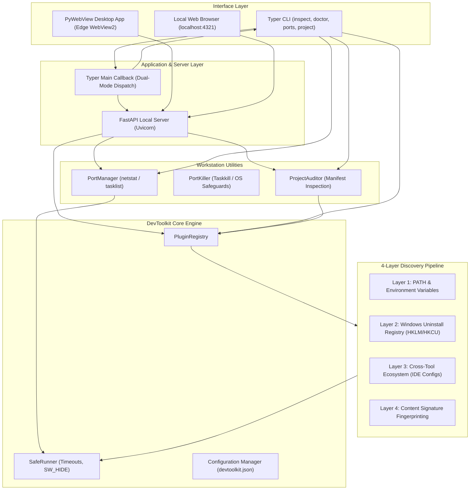
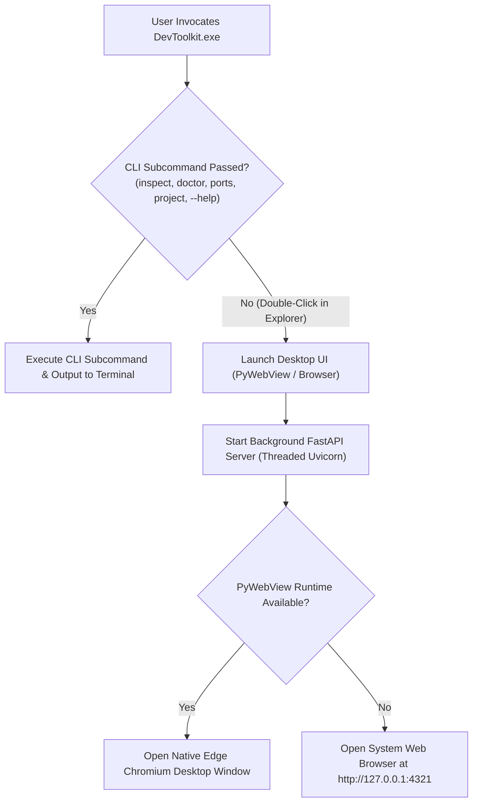

# DevToolkit: Master Software Reference & Technical Manual

> **Author**: Bhardvaj  
> **Version**: 0.3.0 (Phase 7: Deep Tool Inspection & 7-Zone Process Flow)  
> **Repository**: [https://github.com/Bhardvaj/DevToolkit](https://github.com/Bhardvaj/DevToolkit)  
> **Document Purpose**: Authoritative reference manual documenting the software architecture, discovery algorithms, deep inspection heuristics, utility modules, REST APIs, desktop UI, and distribution pipelines.

---

## 1. System Architecture & Core Philosophy

DevToolkit is engineered as an extensible workstation environment auditor, port manager, and developer productivity suite. It bridges the gap between terminal CLI speed and native desktop ergonomics, giving engineers instant insight into their tools, sockets, and project readiness.

### Core Architectural Principles

1. **Zero Hardcoded Paths**:
   No tool location is assumed. SDKs installed in custom drives (e.g. `D:\Dev`, `E:\Tools`), package managers (`nvm-windows`, `pyenv-win`, `scoop`, `winget`, `choco`), or embedded inside IDEs (e.g. Android Studio JBR) are resolved dynamically.
2. **Strictly Sandboxed Execution (`SafeRunner`)**:
   External commands are run with strict timeouts (1.5s - 5s), suppressed console window flashing (`SW_HIDE`, `STARTF_USESHOWWINDOW`), detached standard input (`DEVNULL`), and non-destructive read-only queries.
3. **Decoupled Architecture**:
   The core auditing engine is 100% decoupled from the UI. The same audit logic drives:
   - Colored terminal tables and formatted JSON/YAML output.
   - FastAPI local REST endpoints.
   - Native PyWebView desktop window (using Edge Chromium/WebView2).
   - In-browser dashboards (`localhost:4321`).
4. **Dual-Mode Executable**:
   A single compiled binary (`DevToolkit.exe`) serves dual roles: double-clicking launches the GUI, while terminal commands execute CLI operations.

### Architecture Topology Diagram



---

## 2. The 4-Layer Generalized Discovery Engine

The discovery engine dynamically resolves tool roots, binaries, and companion SDKs through a tiered 4-layer fallback pipeline. If any layer succeeds, subsequent layers are bypassed for performance.

```
+-------------------------------------------------------------+
| Layer 1: Standard PATH & Environment Resolution             |
|   - Searches active PATH directories and where.exe           |
|   - Evaluates standard env flags (JAVA_HOME, ANDROID_HOME)  |
+-------------------------------------------------------------+
                              | (if unresolved)
                              v
+-------------------------------------------------------------+
| Layer 2: OS Uninstall Registry Inspection (Windows)         |
|   - Scans HKLM & HKCU Software\Microsoft\Windows\           |
|     CurrentVersion\Uninstall (64-bit and WOW6432Node)       |
|   - Matches DisplayName and extracts InstallLocation        |
+-------------------------------------------------------------+
                              | (if unresolved)
                              v
+-------------------------------------------------------------+
| Layer 3: Cross-Tool Ecosystem Discovery                     |
|   - Inspects parent IDE configuration XML files             |
|   - Extracts Android Studio JBR, SDK paths, Flutter config   |
+-------------------------------------------------------------+
                              | (if unresolved)
                              v
+-------------------------------------------------------------+
| Layer 4: Content Signature Fingerprinting                   |
|   - Recursively traverses user-configured root directories  |
|     (e.g. D:\Dev, C:\Dev, /opt)                             |
|   - Validates directory structures by marker files          |
+-------------------------------------------------------------+
```

### Layer 1: Standard PATH & Environment Resolution
- Evaluates `os.environ["PATH"]` using `SafeRunner.resolve_binary(name)`.
- On Windows, automatically tests `.exe`, `.cmd`, `.bat`, and `.ps1` extensions.
- Evaluates known tool environment variables (e.g. `JAVA_HOME`, `ANDROID_HOME`, `ANDROID_SDK_ROOT`, `GOROOT`, `GOPATH`, `DOCKER_HOST`, `NVM_HOME`).

### Layer 2: Windows OS Registry Inspection (`WindowsRegistryInventory`)
- Probes four registry root combinations:
  - `HKEY_LOCAL_MACHINE\Software\Microsoft\Windows\CurrentVersion\Uninstall` (64-bit)
  - `HKEY_LOCAL_MACHINE\Software\WOW6432Node\Microsoft\Windows\CurrentVersion\Uninstall` (32-bit)
  - `HKEY_CURRENT_USER\Software\Microsoft\Windows\CurrentVersion\Uninstall` (64-bit)
  - `HKEY_CURRENT_USER\Software\WOW6432Node\Microsoft\Windows\CurrentVersion\Uninstall` (32-bit)
- Matches target tools via regex against `DisplayName`.
- Resolves `InstallLocation` or parses uninstall strings to extract the physical root folder.

### Layer 3: Cross-Tool Ecosystem Discovery (`CrossToolEcosystem`)
- Locates SDKs through tools that bundle or manage them:
  - **Android Studio Config**: Reads `%APPDATA%\Google\AndroidStudio*\options\other.xml` to extract configured Android SDK directories.
  - **Embedded JBR**: Inspects Android Studio installation directories for `jbr/bin/java.exe` or `jre/bin/java.exe`.
  - **Flutter SDK Config**: Reads `%APPDATA%\flutter\tool_state` or global configuration to extract Flutter and Dart SDK locations.
  - **Gradle Properties**: Reads `~/.gradle/gradle.properties` for configured JDK paths.

### Layer 4: Content Signature Fingerprinting (`ContentSignatureEngine`)
- Users specify high-level directories (e.g. `D:\Dev`, `C:\Tools`) in `devtoolkit config add-path <dir>`.
- The engine traverses immediate and second-level subfolders, matching specific structural signatures:
  - **Android SDK**: Folder must contain `platform-tools/adb.exe` AND (`emulator/emulator.exe` OR `cmdline-tools`).
  - **Java / JDK**: Folder must contain `bin/javac.exe` AND (`bin/java.exe` OR `lib/tools.jar`).
  - **Flutter SDK**: Folder must contain `bin/flutter` AND `bin/cache/dart-sdk`.
  - **Go SDK**: Folder must contain `bin/go.exe` AND `src/runtime`.

---

## 3. Tool Inspector Catalog & Diagnostics

DevToolkit includes 22 native inspectors located in `devtoolkit/modules/inspectors/`:

| Tool ID | Inspector Name | Category | Primary Detection Vectors | Key Diagnostics & Companion Checks |
| :--- | :--- | :--- | :--- | :--- |
| `node` | Node.js & Corepack | `runtime` | `node.exe`, nvm-windows, Registry | Checks for `npm`, `pnpm`, `yarn`, `corepack`. Detects nvm active alias. |
| `python` | Python 3 | `runtime` | `python.exe`, pyenv-win, Registry | Detects Windows Microsoft Store 0KB execution alias intercepting standard CPython. Checks for `pip`, `poetry`. |
| `git` | Git for Windows | `vcs` | `git.exe`, Registry | Checks `user.name`, `user.email`, `core.autocrlf` safe Windows configuration, SSH auth agent status. |
| `gh` | GitHub CLI | `vcs` | `gh.exe`, PATH | Probes GitHub authentication state (`gh auth status`), account name, and Git integration. |
| `vscode` | Visual Studio Code | `ide` | `Code.exe`, Registry, Local AppData | Audits `code` CLI in system PATH, `code-insiders`, and warns if app is installed but CLI is missing from PATH. |
| `dotnet` | .NET SDK & Runtime | `runtime` | `dotnet.exe`, `DOTNET_ROOT`, Program Files | Probes installed SDKs (`--list-sdks`), runtimes (`--list-runtimes`), `msbuild`, and `nuget`. |
| `bun` | Bun Runtime | `runtime` | `bun.exe`, `BUN_INSTALL`, `%USERPROFILE%\.bun` | Audits fast JS/TS runtime, `bunx` companion, and PATH inclusion. |
| `cmake` | CMake Build System | `build` | `cmake.exe`, PATH, Content Signature | Probes build generator, companion `ninja`, `ctest`, and `cpack`. |
| `c_compiler` | C/C++ Compiler | `build` | `gcc.exe`, `clang.exe`, PATH, Content Signature | Audits native compilers (`gcc`, `clang`, `g++`, `clang++`), `make`, and debuggers (`gdb`/`lldb`). |
| `ollama` | Ollama Local AI | `ai` | `ollama.exe`, `%LOCALAPPDATA%\Programs\Ollama` | Audits local LLM inference daemon (:11434), installed models list, and `OLLAMA_MODELS`. |
| `cuda` | NVIDIA CUDA Toolkit | `ai` | `nvcc.exe`, `CUDA_PATH`, `nvidia-smi` | Audits GPU device model, driver version, and `nvcc` native CUDA compiler presence. |
| `kubectl` | Kubernetes CLI | `container` | `kubectl.exe`, PATH | Probes client version, cluster current context, `KUBECONFIG`, `helm`, and `minikube`. |
| `terraform` | Terraform | `cloud` | `terraform.exe`, PATH | Probes Terraform version and `tofu` (OpenTofu) compatibility. |
| `php` | PHP & Composer | `runtime` | `php.exe`, PATH, Content Signature | Audits PHP interpreter and Composer package manager. |
| `sqlite` | SQLite Database | `database` | `sqlite3.exe`, PATH | Audits SQLite serverless database engine CLI. |
| `docker` | Docker Engine | `container` | `docker.exe`, Docker Desktop | Queries Docker daemon pipe `\\.\pipe\docker_engine`. Checks for `docker-compose`. |
| `golang` | Go Programming Language | `runtime` | `go.exe`, `GOROOT`, Registry | Checks `GOPATH`, compiler build version. |
| `rust` | Rust Toolchain | `runtime` | `rustc.exe`, `cargo.exe`, rustup | Audits cargo package manager and active toolchain. |
| `java` | Java / OpenJDK | `runtime` | `javac.exe`, `JAVA_HOME`, Registry, Android Studio JBR | Validates `JAVA_HOME` environment variable, checks JDK vs JRE compiler availability, detects embedded JBR. |
| `android` | Android SDK | `mobile` | `adb.exe`, `ANDROID_HOME`, Android Studio XML, Content Signature | Validates `ANDROID_HOME` or `ANDROID_SDK_ROOT`. Checks `adb`, `emulator`, and discovered `build-tools` versions. Provides 1-click `setx ANDROID_HOME` fix. |
| `android_studio` | Android Studio | `ide` | `studio64.exe`, Registry, Start Menu | Locates Studio root, embedded OpenJDK JBR version, and allocated JVM maximum heap memory. |
| `flutter` | Flutter SDK | `mobile` | `flutter.bat`, `dart.exe`, Content Signature | Checks Dart SDK, Flutter channel, and doctor status. |

### 3.1 Phase 7 Deep Tool Inspection Architecture (Batch 1 Core Tools)

In addition to baseline non-blocking discovery, DevToolkit provides on-demand deep telemetry triggered when a user expands the slide-over Inspector Drawer (`GET /api/tool/{tool_id}/deep`):

- **Python (`python`)**:
  - **Multi-Instance Precedence**: Resolves all Python binaries via `where.exe`, classifying active PATH binaries vs. virtual environments (`.venv`), global Program Files CPython, and Windows Store alias stubs.
  - **Environment Alignment**: Evaluates `PYTHONPATH` and `PYTHONHOME`. Flags `missing` or `divergent` if pointing away from the active interpreter.
  - **CLI Diagnostics**: Executes `python -m sysconfig` (extracting paths and platform) and `pip list --outdated --format=json`.
  - **Remediations**: Generates copyable scripts for virtual environment creation (`python -m venv .venv`) and upgrading pip packages.

- **Node.js (`node`)**:
  - **Multi-Instance Precedence**: Scans active node executable against NVM Windows (`%NVM_HOME%`, `%NVM_SYMLINK%`) and Volta installations.
  - **Environment Alignment**: Checks `NODE_PATH` and global prefix (`npm config get prefix`).
  - **CLI Diagnostics**: Captures `npm doctor` health status and queries top global packages (`npm list -g --depth=0`).
  - **Remediations**: Generates copyable commands to switch NVM versions or configure global prefix directories.

- **Git (`git`)**:
  - **Multi-Instance Precedence**: Discovers active Git binary and alternates across Git for Windows, Scoop, or Winget.
  - **Environment Alignment**: Inspects `GIT_EXEC_PATH` and `GIT_SSH`.
  - **CLI Diagnostics**: Executes `git config --list --show-origin` to isolate configuration source files (system, global, local), inspects `user.name`, `user.email`, `core.autocrlf`, and checks for GPG commit signing keys (`user.signingkey`).
  - **Remediations**: Generates copyable commands to configure user identity and CRLF normalization.

- **Docker (`docker`)**:
  - **Daemon Inspection**: Tests daemon socket availability without blocking; checks `DOCKER_HOST`, `DOCKER_TLS_VERIFY`, `DOCKER_CERT_PATH`.
  - **CLI Diagnostics**: Dumps `docker version`, `docker system df` (container, image, volume, and build cache storage utilization), and `docker compose version`.
  - **Remediations**: Generates copyable commands to start Docker Desktop service or prune build caches safely.

- **Java / JDK (`java`)**:
  - **Multi-Instance Precedence**: Scans JDKs across `JAVA_HOME`, Windows Registry, Android Studio embedded JBR, and Gradle properties.
  - **Environment Alignment**: Compares live `JAVA_HOME` against the active compiler path; flags `divergent` if they point to different installations.
  - **Bytecode & Architecture**: Inspects JDK `release` metadata file to verify OS architecture (`x86_64`) and vendor (`Eclipse Adoptium`, `Oracle`, `JetBrains`).
  - **CLI Diagnostics**: Captures `java -XshowSettings:properties -version` and `javac -version`.
  - **Remediations**: Generates copyable PowerShell command to align `JAVA_HOME` with the active JDK path.

- **Go (`golang`)**:
  - **Multi-Instance Precedence**: Detects Go compiler binaries across PATH and custom roots.
  - **Environment Alignment**: Audits `GOROOT` and `GOPATH` for alignment with the active binary.
  - **CLI Diagnostics**: Executes `go env -json` to extract module cache, build cache, and proxy configurations.
  - **Remediations**: Generates copyable scripts to align `GOROOT` and initialize `GOPATH`.

- **Rust (`rust`)**:
  - **Multi-Instance Precedence**: Discovers `rustc` and `cargo` binaries across system PATH and `~/.cargo/bin`.
  - **Environment Alignment**: Checks `RUSTUP_HOME` and `CARGO_HOME`.
  - **CLI Diagnostics**: Dumps `rustup show` (active toolchains, installed targets) and `cargo --version --verbose`.
  - **Remediations**: Generates copyable commands to update rustup toolchains or install target architectures.

- **.NET SDK (`dotnet`)**:
  - **Multi-Instance Precedence**: Discovers active `dotnet.exe` and secondary x86/x64 installations.
  - **Environment Alignment**: Checks `DOTNET_ROOT` and `DOTNET_MULTILEVEL_LOOKUP`.
  - **CLI Diagnostics**: Executes `dotnet --info` and `dotnet --list-sdks`.
  - **Remediations**: Generates copyable commands to set `DOTNET_ROOT` or configure target framework runtimes.

- **Android SDK (`android`)**:
  - **Multi-Instance Precedence**: Scans active `adb` binary, SDK platforms, build-tools, and emulator executables across PATH, `%LOCALAPPDATA%\Android\Sdk`, and custom monitored roots.
  - **Environment Alignment**: Audits `ANDROID_HOME`, `ANDROID_SDK_ROOT`, and `ANDROID_AVD_HOME`.
  - **CLI Diagnostics**: Executes `adb version` and tests connected USB/virtual devices (`adb devices -l`).
  - **Remediations**: Generates copyable PowerShell command to set `ANDROID_HOME` or add `platform-tools` to PATH.

- **Android Studio (`android_studio`)**:
  - **Multi-Instance Precedence**: Scans active Studio installs, Canary/Preview builds, and bundled JetBrains Runtime (`jbr`).
  - **Environment Alignment**: Evaluates `STUDIO_JDK`, `JDK_HOME`, and `JAVA_HOME`.
  - **CLI Diagnostics**: Audits Android SDK directory settings and bundled build-tools version.
  - **Remediations**: Generates copyable commands to align Studio JDK variables.

- **Flutter SDK (`flutter`)**:
  - **Multi-Instance Precedence**: Discovers active `flutter.bat` vs git clone or zip extracts.
  - **Environment Alignment**: Audits `FLUTTER_ROOT` and `PUB_CACHE`.
  - **CLI Diagnostics**: Parses `flutter --version`, git channel (`stable`, `beta`), engine revision, and Dart SDK cache.
  - **Remediations**: Generates copyable commands to update Flutter channels or repair pub cache.

- **Visual Studio Code (`vscode`)**:
  - **Multi-Instance Precedence**: Scans active `code.cmd`, portable zip extracts, and VS Code Insiders (`code-insiders`).
  - **Environment Alignment**: Evaluates `VSCODE_PORTABLE` and `VSCODE_GIT_ASKPASS_NODE`.
  - **CLI Diagnostics**: Checks CLI terminal registration and extensions directory.
  - **Remediations**: Generates copyable commands to add VS Code to system PATH.

- **Kubernetes CLI (`kubectl`)**:
  - **Multi-Instance Precedence**: Discovers all `kubectl` binaries in PATH order.
  - **Environment Alignment**: Audits `KUBECONFIG` path and active context.
  - **CLI Diagnostics**: Executes `kubectl version --client -o json` and reads cluster URL.
  - **Remediations**: Generates copyable commands to initialize `~/.kube/config`.

- **Terraform / OpenTofu (`terraform`)**:
  - **Multi-Instance Precedence**: Discovers `terraform` and `tofu` binaries across PATH and custom roots.
  - **Environment Alignment**: Audits `TF_CLI_CONFIG_FILE` and `TF_PLUGIN_CACHE_DIR`.
  - **CLI Diagnostics**: Dumps provider plugin cache status and active engine flavor (HashiCorp vs OpenTofu).
  - **Remediations**: Generates copyable commands to initialize provider cache directories.

- **GitHub CLI (`gh`)**:
  - **Multi-Instance Precedence**: Discovers `gh` binaries and extensions.
  - **Environment Alignment**: Checks `GH_TOKEN`, `GITHUB_TOKEN`, and `GH_CONFIG_DIR`.
  - **CLI Diagnostics**: Runs `gh auth status` and captures logged-in user account.
  - **Remediations**: Generates copyable commands to authenticate (`gh auth login`).

- **Ollama Local AI (`ollama`)**:
  - **Multi-Instance Precedence**: Discovers `ollama` binaries.
  - **Environment Alignment**: Audits `OLLAMA_HOST` and `OLLAMA_MODELS`.
  - **CLI Diagnostics**: Runs `ollama list` and models storage utilization check.
  - **Remediations**: Generates copyable commands to start daemon or pull models.

- **CMake (`cmake`)**:
  - **Multi-Instance Precedence**: Discovers `cmake` and companion `ninja` build tools.
  - **Environment Alignment**: Audits `CMAKE_GENERATOR` and `CMAKE_BUILD_PARALLEL_LEVEL`.
  - **CLI Diagnostics**: Tests compiler generator compatibility.
  - **Remediations**: Generates copyable commands to install Ninja or configure generators.

- **C/C++ Compiler (`c_compiler`)**:
  - **Multi-Instance Precedence**: Discovers `gcc`, `g++`, `clang`, `clang++`, and `cl.exe`.
  - **Environment Alignment**: Evaluates toolchain roots (`MinGW`, `LLVM`, `MSVC`).
  - **CLI Diagnostics**: Executes `--version` and parses target OS architecture.
  - **Remediations**: Generates copyable commands to install MinGW or LLVM.

- **NVIDIA CUDA Toolkit (`cuda`)**:
  - **Multi-Instance Precedence**: Discovers `nvcc.exe` compiler and `nvidia-smi.exe`.
  - **Environment Alignment**: Audits `CUDA_PATH`, `CUDA_HOME`, and versioned `CUDA_PATH_V*` variables.
  - **CLI Diagnostics**: Runs `nvidia-smi` to extract GPU product name, driver version, and compute capability.
  - **Remediations**: Generates copyable commands to align `CUDA_PATH` with the installed toolkit.

- **PHP & Composer (`php`)**:
  - **Multi-Instance Precedence**: Discovers `php` and `composer` binaries.
  - **Environment Alignment**: Audits `PHP_INI_SCAN_DIR` and `COMPOSER_HOME`.
  - **CLI Diagnostics**: Runs `php -m` to enumerate loaded extensions (curl, openssl, mbstring, pdo).
  - **Remediations**: Generates copyable commands to enable missing extensions in `php.ini`.

- **Bun (`bun`)**:
  - **Multi-Instance Precedence**: Discovers `bun` runtime binaries.
  - **Environment Alignment**: Audits `BUN_INSTALL` path.
  - **CLI Diagnostics**: Evaluates global package directory and Bun runtime version.
  - **Remediations**: Generates copyable commands to install Bun packages or align path.

- **SQLite (`sqlite`)**:
  - **Multi-Instance Precedence**: Discovers `sqlite3` CLI binaries.
  - **Environment Alignment**: Checks system PATH configuration.
  - **CLI Diagnostics**: Queries compile-time options and database engine version.
  - **Remediations**: Generates copyable commands to install SQLite CLI tool.

---

## 4. Workstation Utility Modules

### 4.1 Port Manager & Killer (`devtoolkit/modules/utilities/ports.py`)
Provides native Windows socket discovery and safe process management:
- **Socket Discovery**:
  Executes `netstat -ano -p tcp` with `SafeRunner`, parsing active TCP listening sockets (`LISTENING`).
- **Process Resolution**:
  Executes `tasklist /FO CSV /NH` to map socket PIDs to process executable names in a single high-speed batch.
- **Developer Port Tagging**:
  Flags common development ports: `3000`, `3001`, `4200`, `5000`, `5173`, `8000`, `8080`, `8888`, `9000`, `27017`, `5432`, `3306`, `6379`.
- **System Critical Process Matrix**:
  Hardcoded safety protections preventing termination of critical Windows system processes:
  - `System`, `Registry`, `smss.exe`, `csrss.exe`, `wininit.exe`, `services.exe`, `lsass.exe`, `svchost.exe`, `winlogon.exe`, `spoolsv.exe`, `explorer.exe`.
- **Termination Pipeline**:
  Executes `taskkill /PID <pid> /F`. Rejects system-critical processes unless explicitly overridden with `--force`.

### 4.2 Project Workstation Readiness Auditor (`devtoolkit/modules/utilities/project_auditor.py`)
Audits any local project repository against the host machine's live SDK state:
- **Manifest Detection**:
  - `package.json` -> Node.js, npm, pnpm, yarn
  - `pyproject.toml`, `requirements.txt`, `Pipfile` -> Python 3, pip, poetry
  - `pubspec.yaml` -> Flutter SDK, Dart SDK
  - `build.gradle`, `app/build.gradle` -> Java JDK, Android SDK
  - `Dockerfile`, `docker-compose.yml` -> Docker Engine, Docker Compose
  - `Cargo.toml` -> Rust compiler, Cargo
  - `go.mod` -> Go compiler
- **Prerequisite Checklist**:
  Compares manifest requirements with the live workstation audit summary.
- **Remediation Suggestions**:
  Generates copy-paste setup commands (e.g. `npm install`, `setx ANDROID_HOME "..."`, `python -m venv .venv`).

---

## 5. Dual-Mode Executable & Entrypoint Architecture

The standalone executable `DevToolkit.exe` dynamically detects its launch context:



### Typer Entrypoint Implementation (`devtoolkit/cli/main.py`)
```python
@app.callback(invoke_without_command=True)
def default_callback(
    ctx: typer.Context,
    port: int = typer.Option(4321, "--port", "-p", help="Port for UI server."),
    web: bool = typer.Option(False, "--web", help="Open in browser instead of native desktop window."),
) -> None:
    """DevToolkit: Extensible developer environment auditor and workstation utility."""
    if ctx.invoked_subcommand is None:
        from devtoolkit.server.app import launch_ui
        launch_ui(port=port, web_only=web)
```

---

## 6. Desktop UI Architecture & Modular Server Design

DevToolkit implements a clean, modular server architecture decoupled into domain routers, isolated Pydantic request models, dedicated frontend static assets, and an asset-resolving template engine:

### Module Organization
```
devtoolkit/server/
├── __init__.py                 # Clean package re-exports (app, launch_ui, run_server)
├── app.py                      # Slim FastAPI application orchestrator (~130 lines)
├── models.py                   # Pydantic schemas (OpenFolderRequest, SearchPathRequest, etc.)
├── ui.py                       # Template engine with 3-layer asset resolution
├── static/                     # Dedicated frontend assets (full syntax highlighting)
│   ├── __init__.py             # Python package marker for importlib.resources
│   ├── index.html              # Clean semantic HTML markup (head, sidebar, header, 4 views, drawer, modals)
│   ├── styles.css              # CSS stylesheets (.card-pro, .btn-primary-pro, animations, custom scrollbars)
│   └── app.js                  # Client JavaScript (state, EventSource stream, renderers, keyboard shortcuts)
└── routes/
    ├── __init__.py             # Main API router aggregating all route modules
    ├── system.py               # /api/system, /api/config, /api/config/search-paths
    ├── audit.py                # /api/audit, /api/audit/stream, /api/tools
    ├── ports.py                # /api/ports, /api/ports/kill
    ├── project.py              # /api/project/audit
    └── actions.py              # /api/action/open-folder, /api/action/select-folder, /api/action/apply-fix
```

### Template Loading & Packaging Heuristics (`devtoolkit/server/ui.py`)
The template engine uses a robust 3-tier resolution strategy:
1. `importlib.resources`: Standard Python 3.9+ package traversal.
2. `sys._MEIPASS`: PyInstaller temporary bundle directory resolution for single-file executables.
3. Local filesystem fallback relative to `__file__`.
At serve time, `get_dashboard_html()` inlines `styles.css` and `app.js` into placeholders inside `index.html` to deliver an instantaneous, single-payload document requiring zero extra HTTP round-trips and ensuring 100% offline capability. In development mode, changes to HTML/CSS/JS are reflected immediately upon page refresh.

### Viewport Topology
- Container: `h-screen w-screen overflow-hidden flex flex-col bg-[#08090C]`
- Fixed Sidebar: `w-64 bg-[#0E1015] border-r border-[#1F2430] flex flex-col justify-between p-3.5`
- Top Header: `h-14 px-6 border-b border-[#1F2430] flex items-center justify-between bg-[#08090C]`
- Scrollable Content Area: `flex-1 overflow-y-auto p-6 space-y-6 custom-scrollbar`
- Fixed Bottom Status Bar: `h-9 px-5 bg-[#08090C] border-t border-[#1F2430] flex items-center justify-between`

### Views & Navigation
1. **Environment & Diagnostics (`view-env`)**:
   - **Progressive Async Tool Loading & Skeleton Cards**: Instant first paint (<50ms) rendering 22 shimmer skeleton cards. Server-Sent Events (SSE) streaming (`/api/audit/stream`) audits concurrently across up to 32 worker threads, snapping tools into place as they complete (50–200ms for fast tools, live scanning spinner for slower tools).
   - **Interactive Stat Metric Filter Cards**: 6 top metric cards (*Audited Tools*, *Installed*, *Healthy*, *Action Needed*, *Critical Errors*, *Not Found*) double as one-click filters with active rings and reset pills.
   - **Standardized 7-Zone Slide-Over Inspector Drawer**: Smooth right-side drawer displaying comprehensive forensic tool data:
     - *Zone 1: Identity & Health Header*: Tool icon, name, category, health badge, version chip, and probe latency badge (`12ms`).
     - *Zone 2: Primary Runtime & Quick Access*: Monospace active path, 1-click "Open in Explorer" folder button, copy path button, and discovery source badge.
     - *Zone 3: Multi-Instance & Precedence Discovery*: Lists all discovered instances with `Active (PATH)` vs `Alternate` status badges, source, and instance path.
     - *Zone 4: Environment Variable Alignment Matrix*: Tabular breakdown of relevant runtime env vars (`JAVA_HOME`, `PYTHONPATH`, `GOROOT`, `DOTNET_ROOT`), current values, recommended targets, and health badges (`Aligned`, `Divergent`, `Missing`).
     - *Zone 5: Subsystems & Ecosystem Status*: Companion tools, sub-runtimes, package managers, and versions.
     - *Zone 6: Remediation & Setup Commands*: Strictly copyable terminal commands with a 1-click copy button (purged 1-click system execution for security).
     - *Zone 7: Deep Diagnostics & CLI Telemetry*: Tabbed forensic view containing CLI stdout dumps (e.g., `dotnet --info`, `go env -json`, `git config -l --show-origin`), actionable diagnostic warnings, and full JSON payload export.
     - *On-Demand Shimmer Loader*: Initial drawer open triggers `GET /api/tool/{tool_id}/deep` with animated shimmer skeleton loaders until deep telemetry completes, ensuring zero latency impact on baseline audits.
   - **Uniform Compact Cards**: Clean, balanced grid cards with branded icons, version tags, multi-category chips, primary path snippets, and mini companion counters.
   - **Export Report Menu**: Top toolbar dropdown offering 1-click Markdown table export (clipboard), JSON summary copy, and direct `.md` report download.
   - **Precision Centered Search Bar**: Centered search icon and `Ctrl+K` accelerator badge with mathematical flex alignment.
2. **Port Manager (`view-ports`)**:
   - **Background Asynchronous Pre-fetch**: Sockets are inspected immediately on application startup, keeping socket counts and the sidebar badge populated with zero navigation delay.
   - **Visual Refresh Feedback**: Dedicated spinning animation feedback on the refresh icon with duplicate click prevention and confirmation toast.
   - **Socket Classification & Badging**: Automatic port categorization (*Web / HTTP*, *Database*, *Dev Debug*, *Service*) with distinctive color coding.
   - **1-Click Browser Launch**: "Open in Browser" button (`http://localhost:<port>`) for active web and developer ports.
   - **Process Grouping View Toggle**: Switch between flat sockets table and grouped process cards showing all ports held by each process PID.
   - **Process Safeguards**: Interactive kill process modal with OS-critical process warnings and force flags.
3. **Project Workstation Auditor (`view-project`)**:
   - **Clean Unpopulated Startup**: Input starts clean with helpful placeholder text awaiting explicit user scanning or preset selection.
   - **Native Windows Explorer Picker**: Dedicated "Browse..." button invoking native `FolderBrowserDialog` via background PowerShell without console window flashing (`/api/action/select-folder`). Automatically populates input and triggers readiness check.
   - **Visual Readiness Scorecard**: Animated readiness gauge (0-100%) with satisfied vs. missing breakdown counters and detected manifest tags.
   - **Recent Projects History**: Preserves recently scanned workspace directories in browser `localStorage` for instant 1-click re-scanning.
   - **1-Click Fix Scripting**: Prominent "Copy All Fix Commands" button that generates a combined setup script for missing requirements.
   - **Prerequisites Checklist**: Clear requirement matrix showing detected versions vs expected constraints.
4. **Settings & Preferences (`view-settings`)**:
   - Layer-4 Monitored Search Directories management with native "Browse..." folder selection.
   - System hardware specifications (OS, Architecture, Host Machine, Python runtime, PATH entry count).
5. **Sidebar Brand Header & Software Info Footer**:
   - Clean top header without hardcoded version tags.
   - Dynamic OS, release, and machine architecture detection (`#side-os-info`) and host name (`#side-host-name`).
   - Pinned glassmorphic software info footer displaying DevToolkit version (`v0.2.0`), Python environment version, runtime heartbeat, and quick diagnostics help modal trigger (`?`).

### Native Desktop Keyboard Accelerators
- `Ctrl + K`: Focus global search input.
- `R`: Rescan active view.
- `1`, `2`, `3`, `4`: Instant tab navigation.
- `?`: Toggle keyboard shortcuts cheat sheet.
- `Esc`: Close Slide-Over Inspector Drawer, Kill Modal, Help Modal, or blur search.

---

## 7. REST API Specification

The local FastAPI server runs on `http://127.0.0.1:4321`.

### Endpoints

| Method | Route | Description | Request Body | Response Schema |
| :--- | :--- | :--- | :--- | :--- |
| `GET` | `/api/audit` | Run full workstation audit | None | `AuditSummary` |
| `GET` | `/api/audit/stream` | Stream progressive audit results (SSE) | None | `text/event-stream` (`init`, `tool`, `done`) |
| `POST` | `/api/audit` | Run filtered audit | `AuditRequest` (`categories`, `tool_ids`) | `AuditSummary` |
| `GET` | `/api/tool/{tool_id}/deep` | On-demand deep inspection telemetry | None | `DeepTelemetryReport` |
| `GET` | `/api/system` | Get host OS and telemetry | None | `SystemInfo` |
| `GET` | `/api/tools` | List registered inspectors | None | `List[ToolInfo]` |
| `GET` | `/api/ports` | List listening TCP sockets | Query: `dev_only=bool` | `List[PortInfo]` |
| `POST` | `/api/ports/kill` | Safely kill process on port | `KillPortRequest` (`port`, `force`) | `PortKillResult` |
| `POST` | `/api/project/audit` | Audit repository readiness | `ProjectAuditRequest` (`path`) | `ProjectAuditReport` |
| `GET` | `/api/config` | Read active configuration | None | `DevToolkitConfig` |
| `POST` | `/api/config/search-paths` | Add custom search root | `SearchPathRequest` (`path`) | Status & Updated Config |
| `DELETE` | `/api/config/search-paths` | Remove custom search root | `SearchPathRequest` (`path`) | Status & Updated Config |
| `POST` | `/api/action/open-folder` | Open path in Windows Explorer | `OpenFolderRequest` (`path`) | Status |
| `POST` | `/api/action/select-folder` | Native OS folder browser picker dialog | `SelectFolderRequest` (`initial_path`) | Status & Selected path |
| `POST` | `/api/action/apply-fix` | Apply safe environment fix | `ApplyFixRequest` (`command`) | Status & Output message |
| `GET` | `/` | Serve embedded desktop dashboard | None | `HTMLResponse` |

---

## 8. Standalone Compilation & CI/CD Pipeline

### Local Standalone Build Script (`scripts/build_standalone.ps1`)
Compiles a self-contained, single-file `DevToolkit.exe` binary with PyInstaller:
```powershell
powershell -ExecutionPolicy Bypass -File scripts/build_standalone.ps1
```
Key PyInstaller arguments included:
- `--onefile`
- `--name DevToolkit`
- `--hidden-import uvicorn.*`
- `--hidden-import fastapi`
- `--hidden-import pydantic`
- `--hidden-import rich`
- `--hidden-import typer`
- `--hidden-import pyyaml`
- `--hidden-import webview`
- `--hidden-import webview.platforms.winforms`
- `--hidden-import webview.platforms.edgechromium`

### GitHub Actions Release Pipeline (`.github/workflows/build.yml`)
- Triggered manually via `workflow_dispatch` (with optional release publishing and tag parameters) or on official GitHub release publication (`release: published`).
- Runs full test suite on `windows-latest`.
- Compiles standalone `DevToolkit.exe` binary.
- Performs automated smoke tests (`--help`, `inspect`).
- Uploads workflow artifact and attaches binary to GitHub Release assets.

---

## 9. Extending DevToolkit: Authoring New Inspectors

To add a new tool auditor:
1. Create `devtoolkit/modules/inspectors/<my_tool>.py`.
2. Inherit from `BaseInspector` and implement `id`, `name`, `category`, and `inspect(runner)`.
3. Return a `ToolReport` with resolved paths, version, companion tools, and diagnostics.

```python
from devtoolkit.core.base import BaseInspector
from devtoolkit.core.models import ToolReport, HealthStatus
from devtoolkit.core.runner import SafeRunner

class ZigInspector(BaseInspector):
    id = "zig"
    name = "Zig Compiler"
    category = "runtime"
    description = "Zig programming language compiler and toolchain"

    def inspect(self, runner: SafeRunner) -> ToolReport:
        zig_bin = runner.resolve_binary("zig")
        if not zig_bin:
            return ToolReport(id=self.id, name=self.name, category=self.category, installed=False)

        res = runner.run_command([str(zig_bin), "version"])
        return ToolReport(
            id=self.id,
            name=self.name,
            category=self.category,
            installed=True,
            version=res.stdout.strip() if res.ok else None,
            binary_path=str(zig_bin),
            status=HealthStatus.HEALTHY if res.ok else HealthStatus.WARNING,
        )
```

The new inspector is automatically discovered and loaded by `PluginRegistry` without requiring manual registration.

---

## 10. Precision Design System (Google Stitch)

DevToolkit implements the Google Stitch workstation design system specified in `design/DESIGN.md`.

### A. Tonal Hierarchy & Palette Tokens
- **Canvas Base**: `#08090C` (Obsidian Canvas)
- **Surface Elevation 1**: `#0E1015` (Sidebar & Inspector Drawer)
- **Surface Elevation 2**: `#141721` (Cards, Modals, Table Rows)
- **Subtle Micro-border**: `#1F2430` (1px structure)
- **Strong Micro-border**: `#2E3446` (Modal/active strokes)
- **Primary Emerald**: `#10B981` (hover `#059669`, with `#08090C` dark typography on primary buttons)
- **Semantic Accents**:
  - Cyan: `#06B6D4` (Developer sockets, inspection links, tool detected versions)
  - Violet: `#8B5CF6` (Dev Debug categories, companion subsystems)
  - Amber: `#F59E0B` (Action needed warnings, process PIDs)
  - Crimson: `#EF4444` (Critical errors, missing requirements, kill actions)

### B. Typography
- **UI Font**: `Geist` (400, 500, 600, 700) for structural interfaces, dialogs, titles, and buttons.
- **Data & Monospace Font**: `JetBrains Mono` (400, 500, 600) with `font-feature-settings: "tnum" 1` for paths, versions, PIDs, ports, counters, and keyboard shortcut chips.

### C. Geometry & Radii Rules
- **No Pill Shapes**: Zero `rounded-full` classes on buttons, tags, badges, chips, or table rows.
- **Radii Specifications**:
  - `rounded` (4px / 0.25rem): Buttons, inputs, chips, badges, and tags.
  - `rounded-md` (6px / 0.375rem): Cards and container panels.
  - `rounded-lg` (8px / 0.5rem): Modals.
- **Floating Depth**:
  `box-shadow: 0 12px 32px -4px rgba(0, 0, 0, 0.7), 0 0 0 1px rgba(255, 255, 255, 0.04) inset;`

