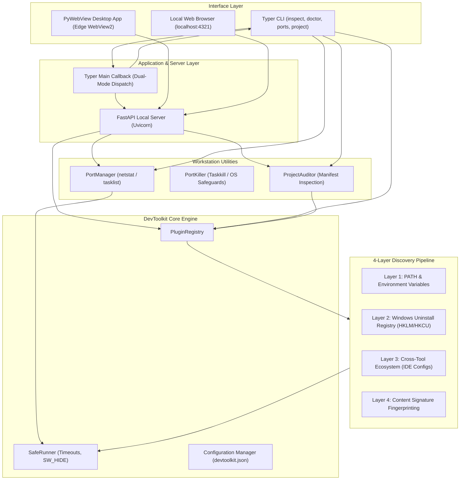
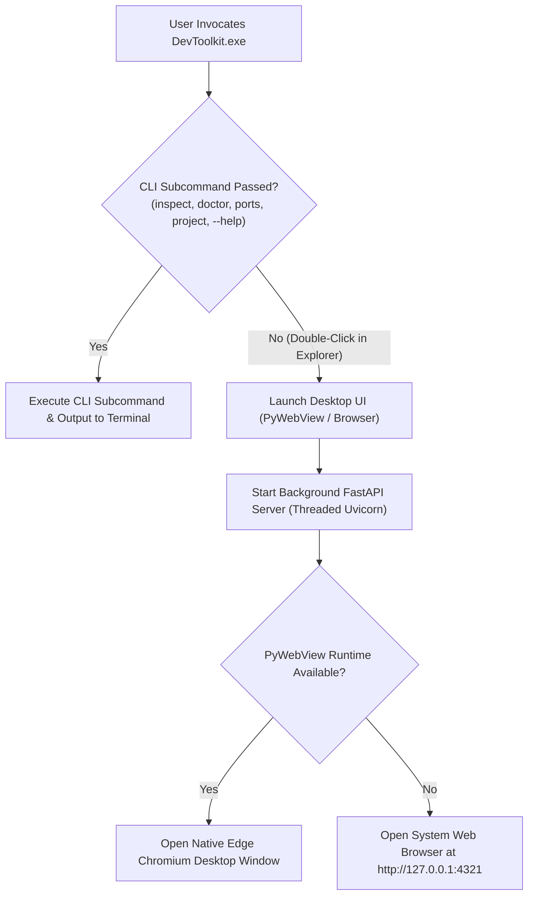

# DevToolkit: Master Software Reference & Technical Manual

> **Author**: Bhardvaj  
> **Version**: 0.2.0 (Phase 3 Course Correction & Desktop UI Polish)  
> **Repository**: [https://github.com/Bhardvaj/DevToolkit](https://github.com/Bhardvaj/DevToolkit)  
> **Document Purpose**: Authoritative reference manual documenting the software architecture, discovery algorithms, inspector heuristics, utility modules, REST APIs, desktop UI, and distribution pipelines.

---

## 1. System Architecture & Core Philosophy

DevToolkit is engineered as an extensible workstation environment auditor, port manager, and developer productivity suite. It bridges the gap between terminal CLI speed and native desktop ergonomics, giving engineers instant insight into their tools, sockets, and project readiness.

### Core Architectural Principles

1. **Zero Hardcoded Paths**:
   No tool location is assumed. SDKs installed in custom drives (e.g. `D:\Dev`, `E:\Tools`), package managers (`nvm-windows`, `pyenv-win`, `scoop`, `winget`, `choco`), or embedded inside IDEs (e.g. Android Studio JBR) are resolved dynamically.
2. **Strictly Sandboxed Execution (`SafeRunner`)**:
   External commands are run with strict timeouts (1.5s - 5s), suppressed console window flashing (`SW_HIDE`, `STARTF_USESHOWWINDOW`), detached standard input (`DEVNULL`), and non-destructive read-only queries.
3. **Decoupled Architecture**:
   The core auditing engine is 100% decoupled from the UI. The same audit logic drives:
   - Colored terminal tables and formatted JSON/YAML output.
   - FastAPI local REST endpoints.
   - Native PyWebView desktop window (using Edge Chromium/WebView2).
   - In-browser dashboards (`localhost:4321`).
4. **Dual-Mode Executable**:
   A single compiled binary (`DevToolkit.exe`) serves dual roles: double-clicking launches the GUI, while terminal commands execute CLI operations.

### Architecture Topology Diagram



---

## 2. The 4-Layer Generalized Discovery Engine

The discovery engine dynamically resolves tool roots, binaries, and companion SDKs through a tiered 4-layer fallback pipeline. If any layer succeeds, subsequent layers are bypassed for performance.

```
+-------------------------------------------------------------+
| Layer 1: Standard PATH & Environment Resolution             |
|   - Searches active PATH directories and where.exe           |
|   - Evaluates standard env flags (JAVA_HOME, ANDROID_HOME)  |
+-------------------------------------------------------------+
                              | (if unresolved)
                              v
+-------------------------------------------------------------+
| Layer 2: OS Uninstall Registry Inspection (Windows)         |
|   - Scans HKLM & HKCU Software\Microsoft\Windows\           |
|     CurrentVersion\Uninstall (64-bit and WOW6432Node)       |
|   - Matches DisplayName and extracts InstallLocation        |
+-------------------------------------------------------------+
                              | (if unresolved)
                              v
+-------------------------------------------------------------+
| Layer 3: Cross-Tool Ecosystem Discovery                     |
|   - Inspects parent IDE configuration XML files             |
|   - Extracts Android Studio JBR, SDK paths, Flutter config   |
+-------------------------------------------------------------+
                              | (if unresolved)
                              v
+-------------------------------------------------------------+
| Layer 4: Content Signature Fingerprinting                   |
|   - Recursively traverses user-configured root directories  |
|     (e.g. D:\Dev, C:\Dev, /opt)                             |
|   - Validates directory structures by marker files          |
+-------------------------------------------------------------+
```

### Layer 1: Standard PATH & Environment Resolution
- Evaluates `os.environ["PATH"]` using `SafeRunner.resolve_binary(name)`.
- On Windows, automatically tests `.exe`, `.cmd`, `.bat`, and `.ps1` extensions.
- Evaluates known tool environment variables (e.g. `JAVA_HOME`, `ANDROID_HOME`, `ANDROID_SDK_ROOT`, `GOROOT`, `GOPATH`, `DOCKER_HOST`, `NVM_HOME`).

### Layer 2: Windows OS Registry Inspection (`WindowsRegistryInventory`)
- Probes four registry root combinations:
  - `HKEY_LOCAL_MACHINE\Software\Microsoft\Windows\CurrentVersion\Uninstall` (64-bit)
  - `HKEY_LOCAL_MACHINE\Software\WOW6432Node\Microsoft\Windows\CurrentVersion\Uninstall` (32-bit)
  - `HKEY_CURRENT_USER\Software\Microsoft\Windows\CurrentVersion\Uninstall` (64-bit)
  - `HKEY_CURRENT_USER\Software\WOW6432Node\Microsoft\Windows\CurrentVersion\Uninstall` (32-bit)
- Matches target tools via regex against `DisplayName`.
- Resolves `InstallLocation` or parses uninstall strings to extract the physical root folder.

### Layer 3: Cross-Tool Ecosystem Discovery (`CrossToolEcosystem`)
- Locates SDKs through tools that bundle or manage them:
  - **Android Studio Config**: Reads `%APPDATA%\Google\AndroidStudio*\options\other.xml` to extract configured Android SDK directories.
  - **Embedded JBR**: Inspects Android Studio installation directories for `jbr/bin/java.exe` or `jre/bin/java.exe`.
  - **Flutter SDK Config**: Reads `%APPDATA%\flutter\tool_state` or global configuration to extract Flutter and Dart SDK locations.
  - **Gradle Properties**: Reads `~/.gradle/gradle.properties` for configured JDK paths.

### Layer 4: Content Signature Fingerprinting (`ContentSignatureEngine`)
- Users specify high-level directories (e.g. `D:\Dev`, `C:\Tools`) in `devtoolkit config add-path <dir>`.
- The engine traverses immediate and second-level subfolders, matching specific structural signatures:
  - **Android SDK**: Folder must contain `platform-tools/adb.exe` AND (`emulator/emulator.exe` OR `cmdline-tools`).
  - **Java / JDK**: Folder must contain `bin/javac.exe` AND (`bin/java.exe` OR `lib/tools.jar`).
  - **Flutter SDK**: Folder must contain `bin/flutter` AND `bin/cache/dart-sdk`.
  - **Go SDK**: Folder must contain `bin/go.exe` AND `src/runtime`.

---

## 3. Tool Inspector Catalog & Diagnostics

DevToolkit includes 22 native inspectors located in `devtoolkit/modules/inspectors/`:

| Tool ID | Inspector Name | Category | Primary Detection Vectors | Key Diagnostics & Companion Checks |
| :--- | :--- | :--- | :--- | :--- |
| `node` | Node.js & Corepack | `runtime` | `node.exe`, nvm-windows, Registry | Checks for `npm`, `pnpm`, `yarn`, `corepack`. Detects nvm active alias. |
| `python` | Python 3 | `runtime` | `python.exe`, pyenv-win, Registry | Detects Windows Microsoft Store 0KB execution alias intercepting standard CPython. Checks for `pip`, `poetry`. |
| `git` | Git for Windows | `vcs` | `git.exe`, Registry | Checks `user.name`, `user.email`, `core.autocrlf` safe Windows configuration, SSH auth agent status. |
| `gh` | GitHub CLI | `vcs` | `gh.exe`, PATH | Probes GitHub authentication state (`gh auth status`), account name, and Git integration. |
| `vscode` | Visual Studio Code | `ide` | `Code.exe`, Registry, Local AppData | Audits `code` CLI in system PATH, `code-insiders`, and warns if app is installed but CLI is missing from PATH. |
| `dotnet` | .NET SDK & Runtime | `runtime` | `dotnet.exe`, `DOTNET_ROOT`, Program Files | Probes installed SDKs (`--list-sdks`), runtimes (`--list-runtimes`), `msbuild`, and `nuget`. |
| `bun` | Bun Runtime | `runtime` | `bun.exe`, `BUN_INSTALL`, `%USERPROFILE%\.bun` | Audits fast JS/TS runtime, `bunx` companion, and PATH inclusion. |
| `cmake` | CMake Build System | `build` | `cmake.exe`, PATH, Content Signature | Probes build generator, companion `ninja`, `ctest`, and `cpack`. |
| `c_compiler` | C/C++ Compiler | `build` | `gcc.exe`, `clang.exe`, PATH, Content Signature | Audits native compilers (`gcc`, `clang`, `g++`, `clang++`), `make`, and debuggers (`gdb`/`lldb`). |
| `ollama` | Ollama Local AI | `ai` | `ollama.exe`, `%LOCALAPPDATA%\Programs\Ollama` | Audits local LLM inference daemon (:11434), installed models list, and `OLLAMA_MODELS`. |
| `cuda` | NVIDIA CUDA Toolkit | `ai` | `nvcc.exe`, `CUDA_PATH`, `nvidia-smi` | Audits GPU device model, driver version, and `nvcc` native CUDA compiler presence. |
| `kubectl` | Kubernetes CLI | `container` | `kubectl.exe`, PATH | Probes client version, cluster current context, `KUBECONFIG`, `helm`, and `minikube`. |
| `terraform` | Terraform | `cloud` | `terraform.exe`, PATH | Probes Terraform version and `tofu` (OpenTofu) compatibility. |
| `php` | PHP & Composer | `runtime` | `php.exe`, PATH, Content Signature | Audits PHP interpreter and Composer package manager. |
| `sqlite` | SQLite Database | `database` | `sqlite3.exe`, PATH | Audits SQLite serverless database engine CLI. |
| `docker` | Docker Engine | `container` | `docker.exe`, Docker Desktop | Queries Docker daemon pipe `\\.\pipe\docker_engine`. Checks for `docker-compose`. |
| `golang` | Go Programming Language | `runtime` | `go.exe`, `GOROOT`, Registry | Checks `GOPATH`, compiler build version. |
| `rust` | Rust Toolchain | `runtime` | `rustc.exe`, `cargo.exe`, rustup | Audits cargo package manager and active toolchain. |
| `java` | Java / OpenJDK | `runtime` | `javac.exe`, `JAVA_HOME`, Registry, Android Studio JBR | Validates `JAVA_HOME` environment variable, checks JDK vs JRE compiler availability, detects embedded JBR. |
| `android` | Android SDK | `mobile` | `adb.exe`, `ANDROID_HOME`, Android Studio XML, Content Signature | Validates `ANDROID_HOME` or `ANDROID_SDK_ROOT`. Checks `adb`, `emulator`, and discovered `build-tools` versions. Provides 1-click `setx ANDROID_HOME` fix. |
| `android_studio` | Android Studio | `ide` | `studio64.exe`, Registry, Start Menu | Locates Studio root, embedded OpenJDK JBR version, and allocated JVM maximum heap memory. |
| `flutter` | Flutter SDK | `mobile` | `flutter.bat`, `dart.exe`, Content Signature | Checks Dart SDK, Flutter channel, and doctor status. |

---

## 4. Workstation Utility Modules

### 4.1 Port Manager & Killer (`devtoolkit/modules/utilities/ports.py`)
Provides native Windows socket discovery and safe process management:
- **Socket Discovery**:
  Executes `netstat -ano -p tcp` with `SafeRunner`, parsing active TCP listening sockets (`LISTENING`).
- **Process Resolution**:
  Executes `tasklist /FO CSV /NH` to map socket PIDs to process executable names in a single high-speed batch.
- **Developer Port Tagging**:
  Flags common development ports: `3000`, `3001`, `4200`, `5000`, `5173`, `8000`, `8080`, `8888`, `9000`, `27017`, `5432`, `3306`, `6379`.
- **System Critical Process Matrix**:
  Hardcoded safety protections preventing termination of critical Windows system processes:
  - `System`, `Registry`, `smss.exe`, `csrss.exe`, `wininit.exe`, `services.exe`, `lsass.exe`, `svchost.exe`, `winlogon.exe`, `spoolsv.exe`, `explorer.exe`.
- **Termination Pipeline**:
  Executes `taskkill /PID <pid> /F`. Rejects system-critical processes unless explicitly overridden with `--force`.

### 4.2 Project Workstation Readiness Auditor (`devtoolkit/modules/utilities/project_auditor.py`)
Audits any local project repository against the host machine's live SDK state:
- **Manifest Detection**:
  - `package.json` -> Node.js, npm, pnpm, yarn
  - `pyproject.toml`, `requirements.txt`, `Pipfile` -> Python 3, pip, poetry
  - `pubspec.yaml` -> Flutter SDK, Dart SDK
  - `build.gradle`, `app/build.gradle` -> Java JDK, Android SDK
  - `Dockerfile`, `docker-compose.yml` -> Docker Engine, Docker Compose
  - `Cargo.toml` -> Rust compiler, Cargo
  - `go.mod` -> Go compiler
- **Prerequisite Checklist**:
  Compares manifest requirements with the live workstation audit summary.
- **Remediation Suggestions**:
  Generates copy-paste setup commands (e.g. `npm install`, `setx ANDROID_HOME "..."`, `python -m venv .venv`).

---

## 5. Dual-Mode Executable & Entrypoint Architecture

The standalone executable `DevToolkit.exe` dynamically detects its launch context:



### Typer Entrypoint Implementation (`devtoolkit/cli/main.py`)
```python
@app.callback(invoke_without_command=True)
def default_callback(
    ctx: typer.Context,
    port: int = typer.Option(4321, "--port", "-p", help="Port for UI server."),
    web: bool = typer.Option(False, "--web", help="Open in browser instead of native desktop window."),
) -> None:
    """DevToolkit: Extensible developer environment auditor and workstation utility."""
    if ctx.invoked_subcommand is None:
        from devtoolkit.server.app import launch_ui
        launch_ui(port=port, web_only=web)
```

---

## 6. Desktop UI Architecture & PC Software Ergonomics

The desktop interface (`EMBEDDED_UI_HTML` in `devtoolkit/server/app.py`) is styled with Tailwind CSS, custom glassmorphism styling, and FontAwesome 6 icons.

### Viewport Topology
- Container: `h-screen w-screen overflow-hidden flex flex-col bg-[#070a13]`
- Fixed Sidebar: `w-64 bg-[#0a0f1d] border-r border-slate-800/80 flex flex-col justify-between p-3.5`
- Top Header: `h-14 px-6 border-b border-slate-800/80 flex items-center justify-between bg-[#090d19]/90`
- Scrollable Content Area: `flex-1 overflow-y-auto p-6 space-y-6 custom-scrollbar`
- Fixed Bottom Status Bar: `h-9 px-5 bg-[#080d18] border-t border-slate-800/80 flex items-center justify-between`

### Views & Navigation
1. **Environment & Diagnostics (`view-env`)**:
   - **Interactive Stat Metric Filter Cards**: 6 top metric cards (*Audited Tools*, *Installed*, *Healthy*, *Action Needed*, *Critical Errors*, *Not Found*) double as one-click filters with active rings and reset pills.
   - **Slide-Over Detail Drawer (Inspector)**: Smooth right-side drawer displaying complete path locations with "Copy" and native "Open in Explorer" actions, full health diagnostics, companion matrix, and raw JSON export.
   - **Uniform Compact Cards**: Clean, balanced grid cards with branded icons, version tags, multi-category chips, primary path snippets, and mini companion counters.
   - **Export Report Menu**: Top toolbar dropdown offering 1-click Markdown table export (clipboard), JSON summary copy, and direct `.md` report download.
   - **Category Pills & Sorting**: Dynamic domain category filtering combined seamlessly with status filtering and multi-attribute sorting.
2. **Port Manager (`view-ports`)**:
   - **Socket Classification & Badging**: Automatic port categorization (*Web / HTTP*, *Database*, *Dev Debug*, *Service*) with distinctive color coding.
   - **1-Click Browser Launch**: "Open in Browser" button (`http://localhost:<port>`) for active web and developer ports.
   - **Process Grouping View Toggle**: Switch between flat sockets table and grouped process cards showing all ports held by each process PID.
   - **Process Safeguards**: Interactive kill process modal with OS-critical process warnings and force flags.
3. **Project Workstation Auditor (`view-project`)**:
   - **Visual Readiness Scorecard**: Animated readiness gauge (0-100%) with satisfied vs. missing breakdown counters and detected manifest tags.
   - **Recent Projects History**: Preserves recently scanned workspace directories in browser `localStorage` for instant 1-click re-scanning.
   - **1-Click Fix Scripting**: Prominent "Copy All Fix Commands" button that generates a combined setup script for missing requirements.
   - **Prerequisites Checklist**: Clear requirement matrix showing detected versions vs expected constraints.
4. **Settings & Preferences (`view-settings`)**:
   - Layer-4 Monitored Search Directories management (add/remove custom search roots).
   - System hardware specifications (OS, Architecture, Host Machine, Python runtime, PATH entry count).

### Native Desktop Keyboard Accelerators
- `Ctrl + K`: Focus global search input.
- `R`: Rescan active view.
- `1`, `2`, `3`, `4`: Instant tab navigation.
- `?`: Toggle keyboard shortcuts cheat sheet.
- `Esc`: Close Slide-Over Inspector Drawer, Kill Modal, Help Modal, or blur search.

---

## 7. REST API Specification

The local FastAPI server runs on `http://127.0.0.1:4321`.

### Endpoints

| Method | Route | Description | Request Body | Response Schema |
| :--- | :--- | :--- | :--- | :--- |
| `GET` | `/api/audit` | Run full workstation audit | None | `AuditSummary` |
| `POST` | `/api/audit` | Run filtered audit | `AuditRequest` (`categories`, `tool_ids`) | `AuditSummary` |
| `GET` | `/api/system` | Get host OS and telemetry | None | `SystemInfo` |
| `GET` | `/api/tools` | List registered inspectors | None | `List[ToolInfo]` |
| `GET` | `/api/ports` | List listening TCP sockets | Query: `dev_only=bool` | `List[PortInfo]` |
| `POST` | `/api/ports/kill` | Safely kill process on port | `KillPortRequest` (`port`, `force`) | `PortKillResult` |
| `POST` | `/api/project/audit` | Audit repository readiness | `ProjectAuditRequest` (`path`) | `ProjectAuditReport` |
| `GET` | `/api/config` | Read active configuration | None | `DevToolkitConfig` |
| `POST` | `/api/config/search-paths` | Add custom search root | `SearchPathRequest` (`path`) | Status & Updated Config |
| `DELETE` | `/api/config/search-paths` | Remove custom search root | `SearchPathRequest` (`path`) | Status & Updated Config |
| `POST` | `/api/action/open-folder` | Open path in Windows Explorer | `OpenFolderRequest` (`path`) | Status |
| `POST` | `/api/action/apply-fix` | Apply safe environment fix | `ApplyFixRequest` (`command`) | Status & Output message |
| `GET` | `/` | Serve embedded desktop dashboard | None | `HTMLResponse` |

---

## 8. Standalone Compilation & CI/CD Pipeline

### Local Standalone Build Script (`scripts/build_standalone.ps1`)
Compiles a self-contained, single-file `DevToolkit.exe` binary with PyInstaller:
```powershell
powershell -ExecutionPolicy Bypass -File scripts/build_standalone.ps1
```
Key PyInstaller arguments included:
- `--onefile`
- `--name DevToolkit`
- `--hidden-import uvicorn.*`
- `--hidden-import fastapi`
- `--hidden-import pydantic`
- `--hidden-import rich`
- `--hidden-import typer`
- `--hidden-import pyyaml`
- `--hidden-import webview`
- `--hidden-import webview.platforms.winforms`
- `--hidden-import webview.platforms.edgechromium`

### GitHub Actions Release Pipeline (`.github/workflows/build.yml`)
- Triggered manually via `workflow_dispatch` (with optional release publishing and tag parameters) or on official GitHub release publication (`release: published`).
- Runs full test suite on `windows-latest`.
- Compiles standalone `DevToolkit.exe` binary.
- Performs automated smoke tests (`--help`, `inspect`).
- Uploads workflow artifact and attaches binary to GitHub Release assets.

---

## 9. Extending DevToolkit: Authoring New Inspectors

To add a new tool auditor:
1. Create `devtoolkit/modules/inspectors/<my_tool>.py`.
2. Inherit from `BaseInspector` and implement `id`, `name`, `category`, and `inspect(runner)`.
3. Return a `ToolReport` with resolved paths, version, companion tools, and diagnostics.

```python
from devtoolkit.core.base import BaseInspector
from devtoolkit.core.models import ToolReport, HealthStatus
from devtoolkit.core.runner import SafeRunner

class ZigInspector(BaseInspector):
    id = "zig"
    name = "Zig Compiler"
    category = "runtime"
    description = "Zig programming language compiler and toolchain"

    def inspect(self, runner: SafeRunner) -> ToolReport:
        zig_bin = runner.resolve_binary("zig")
        if not zig_bin:
            return ToolReport(id=self.id, name=self.name, category=self.category, installed=False)

        res = runner.run_command([str(zig_bin), "version"])
        return ToolReport(
            id=self.id,
            name=self.name,
            category=self.category,
            installed=True,
            version=res.stdout.strip() if res.ok else None,
            binary_path=str(zig_bin),
            status=HealthStatus.HEALTHY if res.ok else HealthStatus.WARNING,
        )
```

The new inspector is automatically discovered and loaded by `PluginRegistry` without requiring manual registration.
