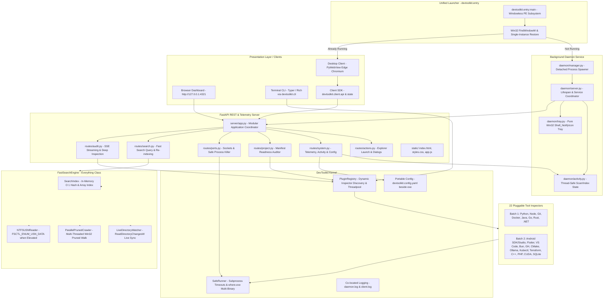
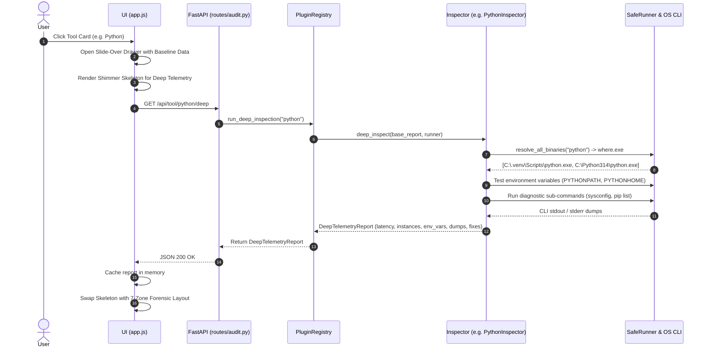
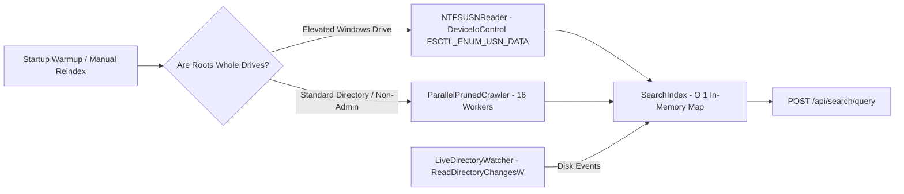

# System Architecture Map & Execution Blueprint

This document serves as the authoritative high-level technical map for `DevToolkit`. Any developer or AI agent entering this project should read this document to understand system boundaries, module interactions, process lifecycles, and data flows.

---

## 1. High-Level Architecture

DevToolkit follows a **Decoupled Client-Daemon Architecture**:
- **Background Daemon**: The central host service managing the local FastAPI REST server, Server-Sent Events (SSE), live telemetry, the standalone Fast Search Engine, and the native Windows notification tray.
- **Client Presentation Layer**: Decoupled clients interacting over HTTP/SSE. Includes the native desktop window (`PyWebView` Edge Chromium), web dashboards, CLI commands, and future lightweight client tools.
- **Unified Entrypoint**: `devtoolkit.entry:main` runs windowless under Windows GUI subsystem, automatically checking for existing instances, starting or connecting to the daemon, and activating the desktop window without console flashes.
- **Zero Host Pollution**: All runtime state (`daemon.json`), user settings (`devtoolkit.config.yaml`), and rotating logs (`daemon.log`, `client.log`) are stored strictly beside the portable executable. `Path.home() / ".devtoolkit"` is never touched.

---

## 2. On-Demand Deep Inspection & 7-Zone Process Flow

DevToolkit separates fast baseline discovery from rich deep telemetry so the initial dashboard render is instant (<50ms) while user-requested tools can be inspected with forensic detail.

### The Standardized 7-Zone Inspector Drawer Layout

1. **Zone 1: Identity & Health Header**: Tool icon, tool name, domain category, health badge (`Healthy`, `Action Needed`, `Not Found`), resolved version, and probe execution latency in milliseconds.
2. **Zone 2: Primary Runtime & Quick Access**: Monospace active binary path, one-click "Open in Explorer" folder button, copy path button, and discovery source badge (`PATH`, `Registry`, etc.).
3. **Zone 3: Multi-Instance & Precedence Discovery**: Comprehensive listing of all detected instances across the machine, labeling the active binary (`Active (PATH)`) versus secondary runtimes (`Alternate` / standby) with source origin tags.
4. **Zone 4: Environment Variable Alignment Matrix**: Tabular breakdown of runtime environment variables (`JAVA_HOME`, `PYTHONPATH`, `GOROOT`, `DOTNET_ROOT`), current values, recommended targets, and health badges (`Aligned`, `Divergent`, `Missing`).
5. **Zone 5: Subsystems & Ecosystem Status**: Companion tools and package managers (e.g., pip, uv, poetry, conda) with operational statuses and versions.
6. **Zone 6: Remediation & Setup Commands**: Strictly copyable terminal commands with a 1-click copy button to resolve path misalignments or missing packages (zero 1-click system mutations).
7. **Zone 7: Deep Diagnostics & CLI Telemetry**: Tabbed forensic view containing CLI stdout dumps (e.g., `dotnet --info`, `go env -json`, `git config -l --show-origin`), actionable diagnostic warnings, and full JSON payload export.

---

## 3. FastSearchEngine Architecture (Everything-Class)

DevToolkit embeds a zero-dependency, sub-millisecond search engine modeled after Voidtools Everything:

- **NTFS USN Change Journal Reader**: Directly streams NTFS master volume metadata via `DeviceIoControl(FSCTL_ENUM_USN_DATA)` when running as Administrator, indexing whole drives (e.g. `C:\`, `D:\`) in <500ms.
- **Parallel Pruned Crawler**: Multi-threaded pruned Win32 directory scanner with 16 worker threads, aggressively skipping developer caches (`node_modules`, `.git`, `.venv`, `__pycache__`) and system junctions.
- **Live Directory Watcher**: Native Win32 `ReadDirectoryChangesW` kernel monitoring running on background daemon threads. Automatically detects file additions, modifications, renames, and deletions in O(1) time without rescanning disk.
- **Intelligent Root Fallbacks**: If user search paths are unconfigured, automatically indexes local fixed drives (`D:\`, `C:\`) on Windows so search works immediately out-of-the-box. In test runs (`DEVTOOLKIT_TESTING=1`), drive crawling is disabled to keep tests fast (<60s).

---

## 4. The 4 Discovery Layers

1. **Layer 1: Standard OS & Environment**:
   - Standard `PATH` resolution (`shutil.which`) with Windows extensions (`.exe`, `.cmd`, `.bat`).
   - Official environment variables (`ANDROID_HOME`, `JAVA_HOME`, `GOROOT`, `CARGO_HOME`).
   - Standard default OS folders (`%LOCALAPPDATA%\Android\Sdk`, `~/Android/Sdk`).

2. **Layer 2: OS Application Inventory**:
   - Reads official Windows Registry `Uninstall` and `App Paths` hives (`HKLM` and `HKCU`).
   - Dynamically resolves installation paths and versions directly from software installer metadata, regardless of which drive or folder the user chose during setup.

3. **Layer 3: Cross-Tool Ecosystem Metadata**:
   - Reads cross-tool configuration files maintained by developer tools:
     - **Android Studio**: `%APPDATA%\Google\AndroidStudio*\options\android.sdk.path.xml` & `jdk.table.xml`.
     - **Flutter**: `flutter config --machine` JSON configuration.
     - **Gradle**: `~/.gradle/gradle.properties` (`org.gradle.java.home`).

4. **Layer 4: User-Configured Search Roots & Content Signatures**:
   - Portable user config: `devtoolkit.config.yaml` beside executable.
   - Structural Content Signatures (identifying SDKs by files, not folder names):
     - **Android SDK**: `platform-tools/adb*` + `build-tools/` or `platforms/`.
     - **JDK**: `bin/javac*` or `release` with `JAVA_VERSION`.
     - **Android Studio**: `product-info.json` (`productCode == "AI"`) or `bin/studio64.exe`.
     - **Flutter SDK**: `bin/flutter*` + `packages/flutter/`.
     - **Rust**: `bin/rustc*` + `bin/cargo*`.
     - **Go**: `bin/go*` + `pkg/tool/`.

---

## 5. Module Boundaries & Safety Guarantees

- **Zero Host Pollution**: All runtime state files (`daemon.json`), user settings (`devtoolkit.config.yaml`), and rotating logs (`daemon.log`, `client.log`) reside strictly beside the executable or in the repo root. The user's home profile directory is never written to.
- **Zero Terminal Window Flashes**: Compiled with `--windowed` PE GUI subsystem and spawned using `CREATE_NO_WINDOW = 0x08000000 | DETACHED_PROCESS`.
- **Zero Hardcoded Paths**: No inspector or runner file may contain arbitrary drive or folder assumptions (e.g. `D:\Dev`). All discoveries must flow through the 4-layer pipeline.
- **Read-Only Inspection**: All subprocess probes strictly execute non-destructive queries (`--version`, `-v`) with mandatory timeouts (default 3.0s).
- **Non-Mutating Remediations**: Tool remediations are presented as copyable terminal commands with a 1-click clipboard button rather than automatic silent system mutations.
- **Extensible Plugins**: Adding a new inspector requires only adding a `BaseInspector` subclass into `devtoolkit/modules/inspectors/`.
