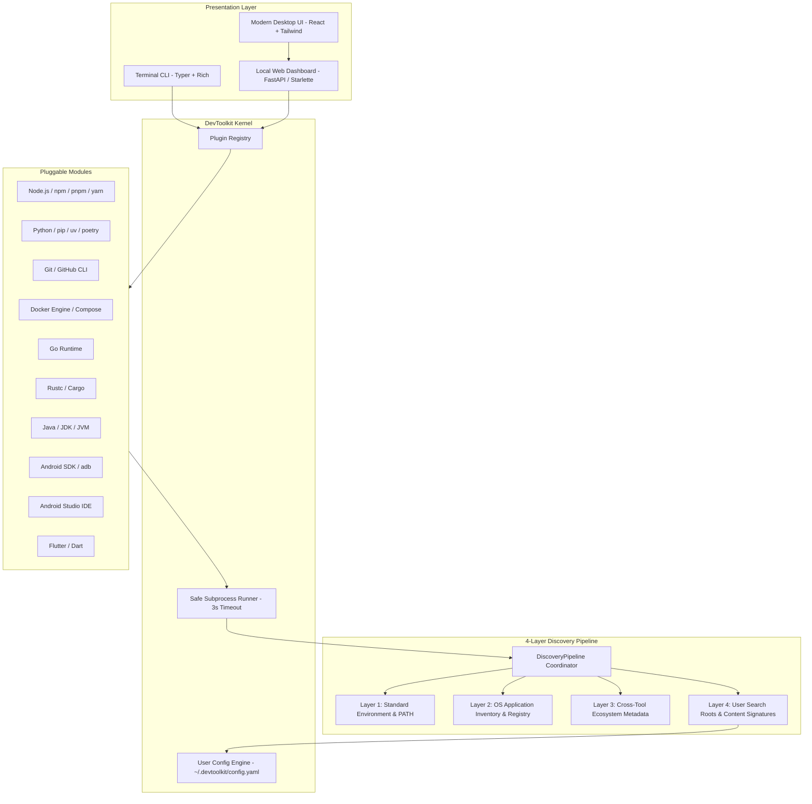

# System Architecture Map & Execution Blueprint

This document serves as the high-level technical map for `DevToolkit`. Any developer or AI agent entering this project should read this document to understand the system layout, module boundaries, data flows, and runtime lifecycles.

---

## 1. High-Level Architecture

DevToolkit decouples the **Core Auditing Engine** from the **Presentation Layer** (CLI and Modern Desktop UI) and implements a **Generalized 4-Layer Discovery Pipeline** that avoids hardcoded machine paths.

---

## 2. The 4 Discovery Layers

1. **Layer 1: Standard OS & Environment**:
   - Standard `PATH` resolution (`shutil.which`) with Windows extensions (`.exe`, `.cmd`, `.bat`).
   - Official environment variables (`ANDROID_HOME`, `JAVA_HOME`, `GOROOT`, `CARGO_HOME`).
   - Standard default OS folders (`%LOCALAPPDATA%\Android\Sdk`, `~/Android/Sdk`).

2. **Layer 2: OS Application Inventory**:
   - Reads official Windows Registry `Uninstall` and `App Paths` hives (`HKLM` and `HKCU`).
   - Dynamically resolves installation paths and versions directly from software installer metadata, regardless of which drive or folder the user chose during setup.

3. **Layer 3: Cross-Tool Ecosystem Metadata**:
   - Reads cross-tool configuration files maintained by developer tools:
     - **Android Studio**: `%APPDATA%\Google\AndroidStudio*\options\android.sdk.path.xml` & `jdk.table.xml`.
     - **Flutter**: `flutter config --machine` JSON configuration.
     - **Gradle**: `~/.gradle/gradle.properties` (`org.gradle.java.home`).

4. **Layer 4: User-Configured Search Roots & Content Signatures**:
   - User config: `~/.devtoolkit/config.yaml` (`devtoolkit config add-path <dir>`).
   - Structural Content Signatures (identifying SDKs by files, not folder names):
     - **Android SDK**: `platform-tools/adb*` + `build-tools/` or `platforms/`.
     - **JDK**: `bin/javac*` or `release` with `JAVA_VERSION`.
     - **Android Studio**: `product-info.json` (`productCode == "AI"`) or `bin/studio64.exe`.
     - **Flutter SDK**: `bin/flutter*` + `packages/flutter/`.
     - **Rust**: `bin/rustc*` + `bin/cargo*`.
     - **Go**: `bin/go*` + `pkg/tool/`.

---

## 3. Module Boundaries & Safety Guarantees

- **Zero Hardcoded Paths**: No inspector or runner file may contain arbitrary drive or folder assumptions (e.g. `D:\Dev`). All discoveries must flow through the 4-layer pipeline.
- **Read-Only Inspection**: All subprocess probes strictly execute non-destructive queries (`--version`, `-v`) with mandatory timeouts (default 3.0s).
- **Extensible Plugins**: Adding a new inspector requires only adding a `BaseInspector` subclass into `devtoolkit/modules/inspectors/`.
