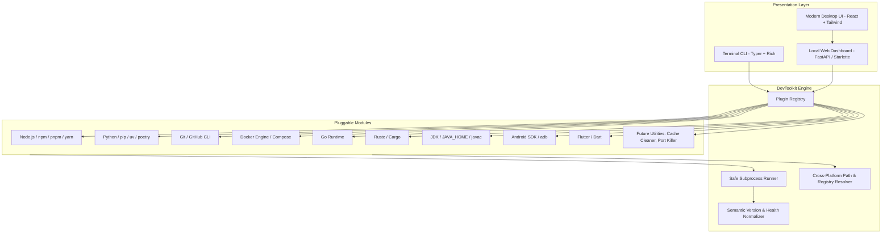

# System Architecture Map & Execution Blueprint

This document serves as the high-level technical map for `DevToolkit`. Any developer or AI agent entering this project should read this document to understand the system layout, module boundaries, data flows, and runtime lifecycles.

---

## 1. High-Level Architecture

DevToolkit decouples the **Core Auditing Engine** from the **Presentation Layer** (CLI and Modern Desktop UI).

---

## 2. Core Execution Lifecycle

When an audit is requested (via CLI command `devtoolkit inspect` or through the desktop UI):

1. **Discovery & Registration**:
   - The `PluginRegistry` dynamically discovers and loads all inspector providers located in `devtoolkit/modules/inspectors/`.
   - Providers register their metadata: unique identifier, human-friendly name, category (e.g., `runtime`, `vcs`, `mobile`, `container`), and priority.

2. **Concurrent Safe Inspection**:
   - Providers execute concurrently via asynchronous workers or thread pools.
   - Every provider invokes binary path searches and version probes through `SafeRunner`.
   - `SafeRunner` enforces strict non-blocking timeouts (default 3 seconds) to guarantee the inspection never hangs due to a stalled CLI process or interactive prompt.

3. **Normalization & Health Assessment**:
   - Raw probe output is cleaned and parsed into semantic versions.
   - Health diagnostics evaluate:
     - Is the binary reachable on the system `PATH`?
     - Are companion tools installed (e.g. `npm` for `node`, `pip` for `python`)?
     - Are required environment variables set (e.g. `ANDROID_HOME`, `JAVA_HOME`)?
     - Are there path collisions or broken symlinks?

4. **Output Rendering**:
   - **CLI Mode**: Rendered via Rich formatted tables, trees, or exported as JSON/YAML.
   - **Desktop UI Mode**: Streamed over local IPC or REST endpoint to the front-end interface.

---

## 3. Module Boundaries & Principles

- **Zero Core Mutation**: Adding a new inspector or utility tool requires *only* adding a standalone module under `devtoolkit/modules/`. The core engine and CLI dispatcher remain untouched.
- **Read-Only Safety**: Inspector probes must never mutate system state. They execute strictly safe flags (`--version`, `-v`, version commands) or inspect filesystem/registry metadata.
- **Cross-Platform Parity**: Path resolution accounts for Windows extensions (`.exe`, `.cmd`, `.bat`, registry keys in `HKLM`/`HKCU`), macOS paths (`/usr/local/bin`, Homebrew), and Linux standard hierarchies (`/usr/bin`, `/snap/bin`).
