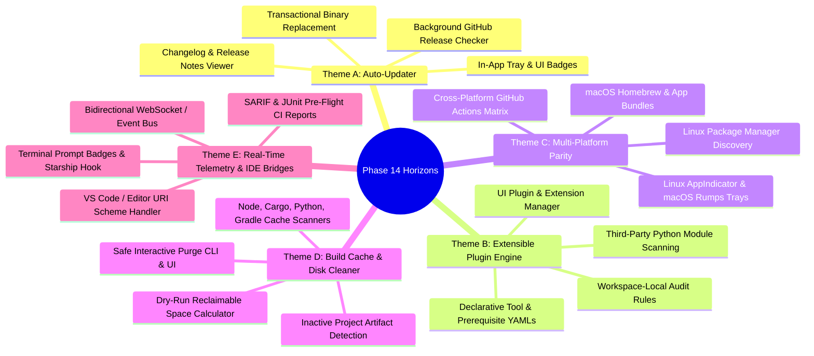

# Phase 14 Brainstorming & Strategic Horizons

> **Status**: Open RFC / Brainstorming  
> **Target Release Cycle**: Phase 14  
> **Previous Milestone**: [Phase 13 (Decoupled Background Daemon & Python Native UI)](../README.md#phase-13)  
> **Architecture State**: Fully decoupled (Background Service ↔ REST/SSE API ↔ Dual Clients: Webview + Tkinter/ttk Native)  
> **Test Coverage Baseline**: 237 / 237 passing tests (100%)  

---

## 🎯 Executive Context

With the completion of **Phase 13**, DevToolkit reached an architectural milestone:
1. **Background Daemon Service**: Runs headlessly as a persistent local server managing system state, socket monitoring, and tool discovery with a Win32 PID lockfile and graceful lifecycle management.
2. **System Tray Integration**: Native, zero-dependency Windows notification tray icon with one-click window restoration, desktop context menus, balloon notifications, and close-to-tray window interception.
3. **Python Native Desktop UI**: High-performance, lightweight native client built with Python's built-in `tkinter` and `ttk` (zero external GUI dependencies), dark obsidian theme tokens, reactive observable store, non-blocking asynchronous API dispatch, deep tool inspector modal, port manager, project auditor, and filesystem search.
4. **Unified Standalone Packaging**: Standalone, self-contained `DevToolkit.exe` (24.13 MB) bundling the CLI, server daemon, system tray, and both UI clients with zero external runtime requirements.

With this foundation established, **Phase 14** presents an opportunity to expand DevToolkit's developer utility, delivery channels, and ecosystem integrations.

---

## 💡 Candidate Themes for Phase 14



---

### 🌟 Theme A: Auto-Updater & In-App Release Delivery

#### 1. Concept Overview
Currently, new versions of `DevToolkit.exe` are built and released via GitHub Actions (`.github/workflows/build.yml`), requiring developers to manually visit the GitHub Releases page to download updates. An integrated update subsystem would make DevToolkit self-updating.

#### 2. Architecture & Technical Design
- **Background Release Checker**:
  - The background daemon periodically queries `https://api.github.com/repos/Bhardvaj/DevToolkit/releases/latest` (cached with ETag / 4-hour intervals).
  - Compares semantic versioning (`v0.X.Y`) against current dynamic version `devtoolkit.__version__`.
- **System Notification & UI Indicators**:
  - System Tray balloon alert: *"DevToolkit vX.Y.Z is available! Click to update."*
  - Dedicated update pill and banner in both Webview and Python Native UIs.
- **Transactional In-Place Binary Swap on Windows**:
  - Windows locks running executables, preventing direct overwrite of `DevToolkit.exe`.
  - Staged download: Download `DevToolkit.exe.new` and verify SHA256 checksum against release manifest.
  - Deferred execution swap: On user approval, launch a detached lightweight batch/PowerShell handoff script that waits for current PID termination, replaces `DevToolkit.exe` with `DevToolkit.exe.new`, cleans up `.old`/`.new` staging files, and restarts the daemon/UI.
- **Offline / Enterprise Resilience**:
  - Configurable update checks (Automatic, Manual Only, or Disabled).
  - Custom release URL mirror support for private enterprise deployments.

#### 3. Key Deliverables
- `devtoolkit/core/updater.py`: Version comparison, manifest verification, staged binary downloader.
- `devtoolkit/cli/main.py`: `devtoolkit update` and `devtoolkit update --check`.
- UI Modals: "New Version Available" dialog with markdown changelog viewer and "Update & Restart" button.

---

### 🔌 Theme B: Extensible Plugin & Custom Rule Engine

#### 1. Concept Overview
While DevToolkit ships with 22 built-in SDK/runtime inspectors and 7 project manifest auditors, organizations and individual developers frequently rely on internal CLI tools, proprietary compilers, corporate proxies, custom certificates, or specialized linters.

#### 2. Architecture & Technical Design
- **Declarative Tool Definitions (`tool.yaml`)**:
  - Allow users to add new tools to the audit table without writing Python code:
    ```yaml
    # ~/.devtoolkit/plugins/tools/internal_cli.yaml
    id: internal-cli
    name: "Acme Cloud CLI"
    category: "cloud"
    binaries: ["acme.exe", "acme"]
    version_args: ["--version"]
    version_regex: 'version\s+([0-9\.]+)'
    env_vars: ["ACME_CONFIG", "ACME_PROFILE"]
    diagnostics_cmd: ["acme", "doctor", "--json"]
    website: "https://internal.acme.corp/cli"
    ```
- **Custom Project Auditor Rules (`rules.yaml`)**:
  - Enable workspace-level policy checks (e.g., verifying internal npm registries, enforcing Python version constraints, checking for required pre-commit hooks).
- **Dynamic Python Plugin Extension**:
  - Support drop-in Python plugins in `~/.devtoolkit/plugins/inspectors/` adhering to `BaseInspector` with automatic sandbox validation and safe execution timeouts.
- **UI Plugin Management Dashboard**:
  - View loaded external plugins, reload without restarting daemon, toggle plugins on/off, and test custom schemas.

#### 3. Key Deliverables
- `devtoolkit/core/plugins/schema.py`: Pydantic/dataclass schema for declarative tool manifests.
- `devtoolkit/core/plugins/loader.py`: Safe directory scanner and validator for YAML/Python plugins.
- UI View: "Extensions & Custom Tools" tab in Settings.

---

### 🌐 Theme C: Multi-Platform Parity (Linux & macOS)

#### 1. Concept Overview
DevToolkit is built on Python 3 and web/Tkinter technologies, but certain subsystems (Win32 `ctypes` system tray, Windows registry discovery, NTFS USN Journal crawler) currently favor Windows. Expanding native parity to Linux and macOS opens DevToolkit to the entire developer community.

#### 2. Architecture & Technical Design
- **Pluggable System Tray Architecture**:
  - Abstract `devtoolkit/daemon/tray.py` into a unified `SystemTrayService` interface.
  - Implement platform backends:
    - Windows: Pure Win32 `ctypes` (existing zero-dependency implementation).
    - Linux: `AppIndicator3` / D-Bus StatusNotifierItem or GTK tray backend.
    - macOS: `rumps` / PyObjC Cocoa status item backend.
- **Platform-Native Discovery Layer**:
  - Adapt Layer-2 inventory from Windows Registry to:
    - Linux: `dpkg-query`, `rpm -qa`, `pacman -Q`, `flatpak list`, `snap list`.
    - macOS: `/Applications` bundle scans, Homebrew cellar discovery (`brew --prefix`), `pkgutil`.
- **Cross-Platform Filesystem Watcher**:
  - Windows: Win32 `ReadDirectoryChangesW` (current).
  - Linux: `inotify` syscalls via `ctypes`.
  - macOS: `FSEvents` via `ctypes` / core services.
- **Cross-Platform CI Compilation**:
  - Expand GitHub Actions matrix to build standalone artifacts:
    - `DevToolkit-linux-x86_64` (GLIBC/musl standalone binary or AppImage).
    - `DevToolkit-macos-universal` (`.dmg` or signed `.app` bundle).

#### 3. Key Deliverables
- Abstract platform interface `devtoolkit/daemon/tray_base.py`.
- Platform adapters for Linux and macOS.
- Multi-runner GitHub Actions packaging workflow.

---

### 🧹 Theme D: Build Cache & Disk Space Optimizer (`devtoolkit clean`)

#### 1. Concept Overview
Modern developer machines accumulate gigabytes of forgotten build artifacts, dangling containers, package caches, and virtual environments across inactive projects. A dedicated workstation cleaner would provide instant visibility into reclaimable disk space.

#### 2. Architecture & Technical Design
- **Supported Cache Targets**:
  - **Node.js**: Inactive `node_modules` (>90 days untouched), `~/.npm/_cacache`, `~/.pnpm-store`, `~/.yarn/cache`.
  - **Python**: Pip cache (`~/.cache/pip` or `%LOCALAPPDATA%\pip\cache`), orphan `.venv` environments, stale `__pycache__` and `.pytest_cache`.
  - **Rust**: Cargo shared cache (`~/.cargo/registry/cache`), massive `target/` directories in stale projects.
  - **Java / Android**: `~/.gradle/caches`, `~/.m2/repository`, stale Gradle daemon logs.
  - **Docker**: Dangling images, dangling build caches, stopped containers (`docker system df`).
  - **C/C++ & CMake**: Lingering `CMakeCache.txt` and `build/` directories.
- **Safety First Principle**:
  - Dry-run analysis by default: calculate potential space savings without touching files.
  - Explicit user confirmation required before any purge operation.
  - Exclude active projects (checked against active Git branches or files modified within N days).
- **Interactive UI & CLI**:
  - CLI: `devtoolkit clean --dry-run` and `devtoolkit clean --target node --target docker`.
  - UI: "Disk Space & Build Caches" dashboard with category breakdown charts, selection checkboxes, and 1-click safe cleanup.

#### 3. Key Deliverables
- `devtoolkit/modules/cleaner/`: Scanners for package managers and build directories.
- `devtoolkit/cli/clean.py`: CLI subcommands with dry-run reports.
- Cleaners view in Webview and Python Native interfaces.

---

### ⚡ Theme E: Real-Time Event Bus & Shell / IDE Integrations

#### 1. Concept Overview
Integrate DevToolkit directly into daily developer workflows: terminal command prompts, code editors (VS Code), and automated CI pre-flight pipelines.

#### 2. Architecture & Technical Design
- **Bidirectional WebSocket / Streaming Event Bus**:
  - Transition client-server communication from polling to true real-time pub/sub:
    - Live port bind/unbind events pushed immediately to open Port Manager views.
    - Filesystem search index additions pushed without UI refresh.
    - System health state transitions streamed with sub-10ms latency.
- **Terminal Shell Prompt Integrations**:
  - Ultra-fast CLI hook (`devtoolkit prompt-status` responding in <15ms):
    - Integrates into PowerShell `$PROFILE`, Starship prompt, or Oh-My-Zsh.
    - Displays visual prompt indicators for active dev port conflicts or missing project SDK requirements.
- **Editor Protocol Handlers (`devtoolkit://`)**:
  - Register custom OS URI scheme `devtoolkit://inspect/python` or `devtoolkit://project/audit`.
  - Clickable links in browser dashboards or terminal output open DevToolkit directly focused on the requested tool or project.
- **CI Pre-Flight Audit Exporters**:
  - `devtoolkit inspect --format sarif`: Outputs Static Analysis Results Interchange Format (SARIF) for GitHub Security tabs.
  - `devtoolkit project . --format junit`: Generates test result XMLs for CI runners to block builds when workstation SDK versions diverge.

#### 3. Key Deliverables
- `devtoolkit/server/routes/events.py`: WebSocket server endpoint with client channel subscription.
- `devtoolkit/core/export/sarif.py` & `junit.py`: Pre-flight audit formatters.
- Shell prompt script templates in `scripts/shell/`.

---

## 📊 Evaluation & Trade-off Matrix

| Candidate Theme | Developer Impact | Implementation Complexity | Dependency Footprint | Immediate Feasibility |
| :--- | :---: | :---: | :---: | :---: |
| **Theme A: Auto-Updater** | 🟢 High | 🟡 Moderate (Windows file lock handoff) | 🟢 Zero (uses GitHub Releases API + PowerShell) | 🟢 High (CI pipeline already in place) |
| **Theme B: Extensible Plugins** | 🟢 High | 🟡 Moderate (YAML parsing & validation) | 🟢 Zero (`pyyaml` already included) | 🟢 High (Modular engine architecture ready) |
| **Theme C: Multi-Platform** | 🟡 Medium-High | 🔴 High (Platform-specific system trays & libraries) | 🟡 Moderate (may require OS-specific packages) | 🟡 Medium (Requires Linux/macOS testing environments) |
| **Theme D: Disk Space Cleaner** | 🟢 High | 🟢 Low-Moderate (Filesystem directory scanning) | 🟢 Zero (Pure standard library) | 🟢 Very High (High user delight, immediate utility) |
| **Theme E: Real-Time & IDE** | 🟡 Medium | 🟡 Moderate (WebSocket router + client handling) | 🟢 Zero (FastAPI + Starlette WebSockets) | 🟢 High (Complements existing SSE engine) |

---

## 🚀 Recommended Synthesis Options

### Option 1: "Workstation Maintenance Suite" (Theme D + Theme A)
Combine **Build Cache & Disk Space Optimizer** (`devtoolkit clean`) with the **In-App Auto-Updater**.  
*Why it works*: Gives users a compelling new day-to-day developer utility (reclaiming 10–50 GB of disk space) while establishing automated software delivery directly to workstations.

### Option 2: "Developer Ecosystem & Extensibility" (Theme B + Theme E)
Combine **Extensible Plugin Engine** (`tool.yaml` & custom auditor rules) with **Real-Time WebSockets & CI SARIF Exporters**.  
*Why it works*: Transforms DevToolkit from a pre-configured utility into an enterprise-grade platform extensible by teams, companies, and community contributors.

### Option 3: "Global Cross-Platform Delivery" (Theme C + Theme A)
Combine **Multi-Platform Parity (Linux & macOS)** with **Universal Auto-Updates**.  
*Why it works*: Broadens DevToolkit's user base beyond Windows to engineers on macOS and Linux workstations.

---

## 📝 Next Steps for Alignment
1. **User Feedback**: Select the preferred theme, hybrid combination, or suggest custom additions.
2. **Phase 14 Task Breakdown**: Generate detailed task specifications (Tasks 14-01 through 14-05) once the scope is chosen.
3. **Execution Plan**: Initialize branch governance, test cases, and architectural decision records (ADRs).

